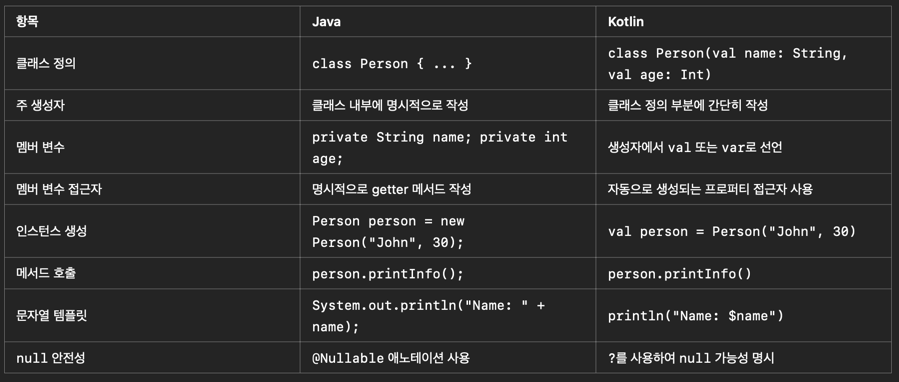
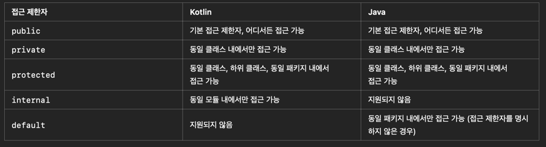
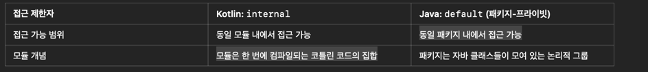
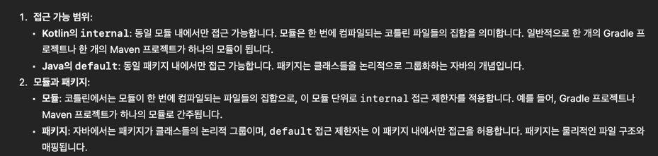
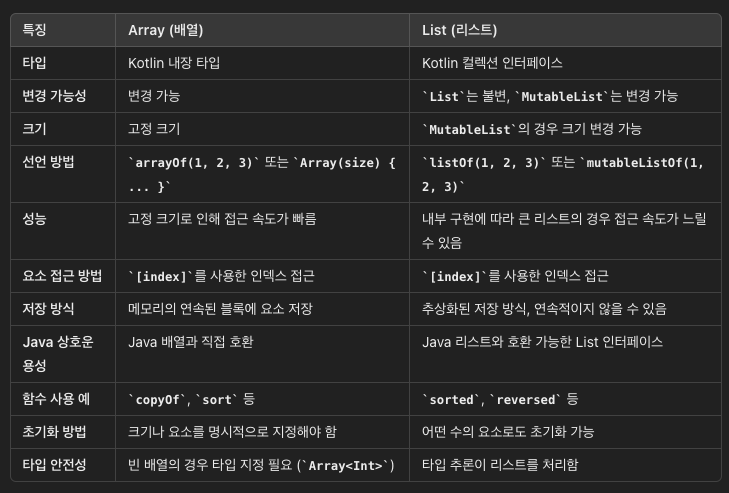

# 2부 객체 소개

- IntRange(0,10) == 0..10

```kotlin
    println(IntRange(1,10).sum())
```

- 타입변경

```kotlin
    val s= "123".toInt()
    val st = 123.toString()
```



- 자바는 클래스 정의시 {} 가 필수적, 코틀린은 없어도 정의됨
- 자바는 인스턴스 생성시 new 키워드 필수적, 코틀린은 없어도 됨
- 코틀린에서 this 없이도 인스턴스의 메소드를 호출할수 있다. 따라서 불필요한 경우 this는 사용하지 않는 것을 권장한다.


---
## 프로퍼티

```kotlin
class House{
    var sofa: String = ""
}

fun main(){
    val house = House();
    house.sofa = "Simple sleeper sofa : $89.00"
    println(house.sofa)
    house.sofa = "New leather sofa: $3,099.00"
    println(house.sofa)
}
```

- house 변수에 객체를 재할당하는 것은 불가능하다. house 내의 sofa는 var 변수 이므로 변경이 가능하다.

- 코틀린의 생성자 만들기

```kotlin
class AlienSpecies(
    val name: String,
    val eyes: Int,
    val hands: Int,
    val legs: Int
){
    fun describe() = "$name + $eyes + $hands + $legs"
}
```

- 코틀린의 오버라이드

```kotlin
class Scientist(val name: String){
    override fun toString(): String {
        return "Scientist('$name')"
}
}
```

---

## 가시성 제한하기

- 코틀린의 접근제한자 : public, private, protected, internal



- 접근제한자를 적지 않을때 자바는 default(package private)
코틀린은 public으로 적용된다.

- 코틀린의 internal과 자바의 default는 차이가 있다.
- (참고)https://mhwan.tistory.com/74

- 자바의 패키지 내에는 클래스와 인터페이지의 모음이지만, 코틀린의 모듈은 클래스 외부에도 함수나 변수를 선언할수 있다.



- 클래스 내부의 참조를 private으로 정의한다고 해도, 그 참조가 가리키는 객체에 대한 public 참조가 없다는 사실을 보장해주지는 못한다.(p123 예시코드)

---
## 패키지

- import kotlin.math.PI as circleRatio  ::  alliasing
- 파일이름이 항상 클래스 이름과 같아야 하는 자바와 달리, 코틀린에서는 소스코드 파일 이름으로 아무 이름이나 붙여도 된다.
- 패키지 이름도 아무이름으로 할 수 있지만, 패키지이름과 패키지 파일의 디렉터리 경로를 똑같이 하는게 좋은 스타일이다.

---
## 테스트

- inflix 키워드를 붙인 함수는 중위 표기법을 이용해 호출할 수 있다.
```kotlin

class Person(val name: String) {
    infix fun likes(anotherPerson: Person) {
        println("${this.name} likes ${anotherPerson.name}")
    }
}

fun main() {
    val john = Person("John")
    val jane = Person("Jane")

    john likes jane  // Infix 표기법 사용
    // Equivalent to: john.likes(jane)
}
```

---
## 리스트

```kotlin

val ints = listOf(99,3,5,7,11,13)  // immutable list
val intsSorted = ints.sorted()  // 원본은 변하지 않는다.
val intsReversed = ints.reversed() // 원본은 변하지 않는다.


```

- 리스트 반환타입을 명시할 경우는 타입 파라미터까지 명시해 주어야 한다.

```kotlin
fun inferred(p: Char, q: Char)  = listOf(p,q)
fun explicit(p: Char, q:Char) : List = listOf(p,q) // 에러
fun explicit(p: Char, q:Char) : List<Char> = listOf(p,q)
```

- 읽기 전용과 가변 리스트

```kotlin
val list = mutableListOf<Int>()  // <Int> 는 생략 가능

list.add(1)
list.addAll(listOf(1,2))  // 가변 리스트에는 추가, 삭제 메소드가 존재한다.

list += 4  
list += listOf(5,6)  // 이런식으로 추가도 가능

//
//val numbers2 = listOf(1,2,3)
//println(number2 += listOf(1,2,3))  // 불편리스트에 하면 에러 발생

```

- 리턴값이 List<Int> 로 지정된 경우 mutableList를 리턴해도 immutable이다.

```kotlin
fun getList() : List<Int> {
    return mutableListOf(1,2,3)
}
fun getList2() : MutableList<Int>{
    return mutableListOf(1,2,3);
}

fun main(){
    val list = getList()  // immutable List이다.
    val list2 = getList2() // mutable List이다.
    list += 3  // 에러가 발생한다.
    list2 += 3 // 잘 작동한다.
}
```

- (p148)
```kotlin
val first = mutableListOf(1)
val second: List<Int> = first 

first += 2  // second는 first의 참조값을 가지고 있으므로, second 값도 같이 바뀐다. 

```

- (p149)

```kotlin

val list1 = mutableListOf('A')
list1 += 'A'
list1.plusAssign('A')  // 가변객체에 값이 한나씩 추가 ['A','A','A']

val list2 = listOf('B')
list += 'B' // 에러


var list3 = listOf('C')
list3 += 'C'   // ['C' ,'C] 인 새로운 객체 만들어서 list3 삽입
val newList = list3 + 'C'
println(list3 == newList) // false

```
---
## 가변인자목록

```kotlin
fun v(s:String, vararg d: Double){}
```

- 함수정의에는 vararg로 선언된 인자가 최대 하나만 있어야 한다.
- 일반적으로 마지막에 선언하는게 간편하지만, 중간에 선언해도 된다.
- vararg 는 Array로 취급된다. (Array는 항상 가변객체이다.)
- Array를 스프레드 목록으로 변환할때 * 를 사용한다.
- list.toIntArray()  :: 리스트를 Array로 변환
- 원시타입(Int, Double, Boolean) 의 Array를 전달할때는 구체적인 타입 이름이 지정된
Array 생성 함수를 사용해야 한다.
- 스프레드 연산자는 배열에만 적용할수 있다. List 인자 목록을 전달하고 싶으면 Array로 변환후 사용해야 한다. (**중요**)


```kotlin
fun printNumbers(vararg numbers: Int) {
    for (number in numbers) {
        println(number)
    }
}

fun main() {
    val list = listOf(1, 2, 3, 4)
    val intArray = list.toIntArray() // Convert List to IntArray
    printNumbers(*intArray) // Using spread operator with IntArray
    printNumbers(*list)  // 에러 발생
}

```

- Array, List 차이점


---
## 명령줄 인자

- 명령줄 인자를 받으려면 파라미터를 지정해야 한다.

```kotlin
fun main(args : Array<String>) {  // Array<String> 없으면 에러 발생
    for (a in args)
    	print(a) 
}
```

- 인텔리제이 실행설정 인자, kotlinc 컴파일러 사용해서 명령줄 프로그램 생성 할수 있다.

---
## 집합
```kotlin
val list = listOf(3,3,2,1,2) // 불변
val list2 = mutableSetOf(1,2,1,2,3) // 가변

list.toSet()
list.distinct()
"aabbcc".toSet()  //['a','b','c'] 중복을 제거한 char 타입요소 set반환

list.contains(2)  // true
list.containsAll(setOf(1,2,9)) // false
list.union(setOf(3,4)) // [1,2,3,4]
list.intersect(setOf(0,1,2,7,8)) // [2]
list.subtract(setOf(1)) // [2,3]
list - setOf(2,3) // [1]
```

---
## 맵

```kotlin
import kotlin.contracts.contract

val constants = mapOf(  // {Pi=3.14, e=2.718, phi=1.618}
    "Pi" to 3.14,
    "e" to 2.718,
    "phi" to 1.618
)

constants["e"]
constants.keys    //[Pi, e, phi]
constants.values   //[3.14, 2.718, 1.618]
constants.entries   //[Pi=3.14, e=2.718, phi=1.618]

for (entry in constants)
    print("${entry.key}=${entry.value} ")  //Pi=3.14 e=2.718 phi=1.618

for ((key, value) in constants)  //Pi=3.14 e=2.718 phi=1.618 
    print("$key=$value ")

for (entry in constants)  //Pi=3.14 e=2.718 phi=1.618 
    print("${entry} ")

```


- MutableMap

```kotlin

val m = mutableMapOf(5 to "five", 6 to "six")
val m2 = mapOf(5 to "five", 6 to "six")

m[5] = "5ive"        //{5=5ive, 6=six}
m2[5] = "5ive"        //에러

m += (4 to "four")   //{5=five, 6=six, 4=four}
m2 += (4 to "four")   //에러

val m3 = m + (4 to "four")//{5=five, 6=six, 4=four}

```

- mapOf(), mutableMapOf() 는 순서를 유지한다.
- 읽기전용 Map 에 원소를 추가하는 유일한 방법은 새로운 map을 만드는 것이다.
- 키에 해당하는 값이 없으면 null을 반환한다.
- null이 될수 없는 결과를 원하면 getValu()를 사용한다.

```kotlin
val map = mapOf( 'a' to "attemp")
map['b']  // null
map.getValue('b') //NoSuchElementException: Key b is missing in the map.
map.getOrDefault('b', "??")  //??

```

---
## 프로퍼티 접근자

```kotlin
data class Student(
    var name: String,
    val age: Int
) {
    var nickname: String = name
        get() {
            println("Getting nickname")
            return field
        }
        set(value) {
            println("Setting nickname to $value")
            field = value
        }
}

fun main() {
    val son = Student("son", 30)
    println(son.name) // son
    son.name = "hi"
    println(son.name) // hi
    println(son.age)  // 30

    // 커스터마이즈된 getter와 setter 사용
    println(son.nickname) // Getting nickname \n son
    son.nickname = "sonny" // Setting nickname to sonny
    println(son.nickname) // Getting nickname \n sonny
}
```

- get(), set()을 연결된 프로퍼티보다 들여쓴다. (가독성)
- 프로퍼티 정의 바로 뒤에 쓰기 때문에 코틀린은 해당 프로퍼티의 getter, setter로 인식
- 게터 세터 안에서는 field 라는 값이 접근할수 있다. field는 getter, setter 안에서만 접근할수 있다.

```kotlin
class Counter {
    var value: Int = 0
        private set

    fun inc() = value++
}
fun main() {
    val counter = Counter()
    repeat(10) {
        counter.inc()
    }
}

```
- private set 으로 value에 대한 직접적 접근을 차단함

---
## 2부요약

- inflx로 함수정의시 중위표기법으로도 호출가능 pi.eq(3.14)  => pi eq 3.14
- sorted(), reversed()는 원본 변경하지 않는다.

```kotlin
package summary2


class Badger(id: String, years: Int) {
    val name = id
    val age = years
    override fun toString(): String {
        return "Badger: $name, age: $age"
    }
}
// toString() 에서 id, years 에 직접 접근할수 없다

class Snake(
    var type: String,
    var length: Double
) {
    override fun toString(): String {
        return "Snake: $type, length: $length"
    }
}

class Moose(
    val age: Int,
    val height: Double
) {
    override fun toString(): String {
        return "Moose, age: $age, height: $height"
    }
}

fun main() {
    println(Badger("Bob", 11) )
    println(Snake("Garden", 2.4) )
    println(Moose(16, 7.2) )
    
    /*
    Badger: Bob, age: 11
    Snake: Garden, length: 2.4
    Moose, age: 16, height: 7.2 */
}


```

- Badger의 파라미터는 생성자 본문에서만 쓸수 있다.
- 생성자 파라미터를 var, val 로 정의하면 프로퍼티로 바뀌고, 접근가능하게 된다.
