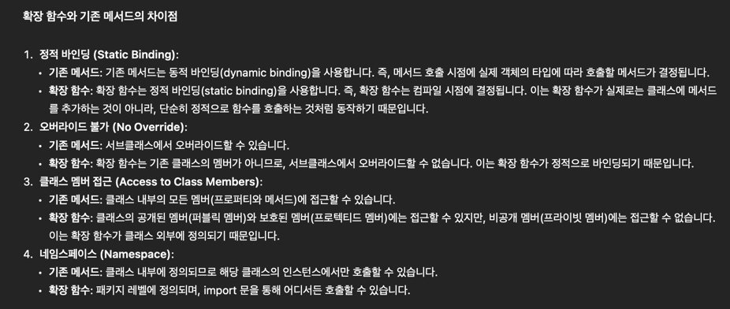
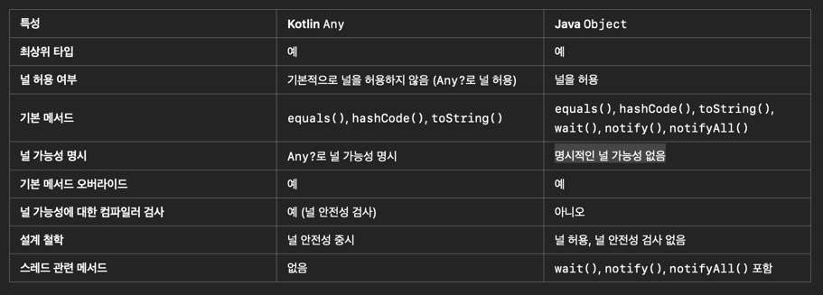

# 3부 사용성

## 30. 확장함수
```kotlin
fun String.singleQuote() = "'$this'"
println("hello".singleQuote())   // 'hello'

fun String.doubleQuote() = "\"$this\""
println("Test".doubleQuote())

class Book(val title: String)
fun Book.categorize(category: String) = """title: : "$title" , category: $category"""  //title: : "바람과 함께 사라지다" , category: 소설
```

- 확장함수 쓸때도 this 없이 public 매개변수에 접근할 수 있다.


## 31. 이름 붙은인자와 디폴트 인자
```kotlin
fun color(
    red: Int = 0,
    green: Int = 0,
    blue: Int = 0,
) = "($red, $green, $blue"
```

- 이름 붙은 인자를 사용하면 가독성이 좋아진다.
- 이름 붙은 인자를 사용하면 순서를 변경할수 있다.
- 순서를 변경하면 인자목록의 나머지 부분도 이름붙은 인자를 사용해야 한다.
- 덧붙은콤마를 사용하면, 콤마를 추가하거나 빼지 않아도 새로운 아이템을 추가하거나 아이템순서를 바꿀수 있다.

```kotlin
val list = listOf(1,2,3,)     // 덧붙은 콤마가 사용되었다.
    println(list.toString())  //[1, 2, 3]
    println(list.joinToString("+")) //1+2+3\
    println(list.joinToString(prefix = "(", postfix = ")")) //(1, 2, 3)
```

```kotlin
val poem2 = """|->Lst night I saw upon the stair
            |->A little man who wasn't there
            |->He wasn't there again today
            |->Oh, how I wish he'd go away."""

    println(poem2.trimMargin(marginPrefix = "|->"))

//Lst night I saw upon the stair
//A little man who wasn't there
//He wasn't there again today
//Oh, how I wish he'd go away.
```
- trimMargin의 default 경계 인자값은 | 이다.
- "|->" 로 바꾸면 위 문자열이 trim된 문자열을 리턴받는다. ( 사용시 이름붙은 인자 marginPrefix를 사용하여 가독성이 좋아졌다.)

## 32. 오버로딩

```kotlin
class My{
    fun foo() = 0
}

fun My.foo() = 1
fun My.foo(i: Int) = i+2
fun main() {
    println(My().foo())
    println(My().foo(1))
}
```

- 멤버와 시그니처가 중복되는 확장함수는 호출될수 없다. (확장함수와 시그니처가 같은 멤버함수가 있으면 코틀린은 멤버함수를 우선시 한다.)
- 다른 파라미터 목록을 제공하여 멤버함수를 확장 함수로 오버로딩할 수 있다.

## 33. when 식

```kotlin
fun main() {
    val dayOfWeek = 3
    val dayName = when (dayOfWeek) {
        1 -> "Sunday"
        2 -> "Monday"
        3 -> "Tuesday"
        4 -> "Wednesday"
        5 -> "Thursday"
        6 -> "Friday"
        7 -> "Saturday"
        else -> "Invalid day"
    }
    println(dayName)  // 출력: Tuesday
    
    // 표현식으로 사용할 때는 when의 결과를 변수에 저장하거나 반환합니다. 이 경우에는 모든 가능한 경우를 처리해야 하므로 else가 필요합니다.
}
```

- 가장 먼저 일치하는 매치식에서 when 식의 실행이 끝난다.
- else 키워드는 일치하는 매치식이 없을때 대안으로 사용할 식을 제공한다. else는 항상 매치 목록의
맨 마지막에 있어야 한다.
- when 식을 문처럼 취급하는 경우(when의 결과를 사용하지 않는 경우)에만 else를 생략할 수 있다.
```kotlin
fun main() {
    val number = 3

    when (number) {
        1 -> println("One")
        2 -> println("Two")
        3 -> println("Three")
        // 'else'가 없어도 컴파일 오류가 발생하지 않습니다.
    }
}
//문장으로 사용할 때는 when의 결과를 변수에 저장하거나 반환하지 않고, 단순히 조건에 따라 작업을 수행합니다. 이 경우에는 모든 경우를 처리할 필요가 없으므로 else를 생략할 수 있습니다.
```

```kotlin
fun main() {
    val day = "MON"

    when (day) {
        "MON", "TUE", "WED", "THU"-> println("Weekday")
        "SAT", "SUN" -> println("Weekend")
        "FRI" -> {}   // 아무일도 하지 않음은 {}로 나타낸다.
        "exit" -> return  // 자신을 둘러싼 함수를 반환한다.
        else -> println("Invalid day")
    }
}

```
- 콤마를 써서 여러 값을 나열해서 사용할수도 있다.


```kotlin
fun main() {
    val number = 5

    when (number) {
        0, 1 -> {
            println("Number is zero or one.")
            println("Special case handling for $number.")
        }
        in 2..5 -> {
            println("Number is between two and five.")
            println("This is a common range.")
            println("Performing multiple actions for $number.")
        }
        else -> {
            println("Number is outside the expected range.")
            println("Default case handling.")
        }
    }
}
```
- 화살표 오른쪽에 여러 동작을 수행해야 하는 경우 블록을 사용해야 한다.
- "FRI" -> {}   // 아무일도 하지 않음은 {}로 나타낸다.
- 자바의 CASE 문은 상수나, 열거형 상수만 받을수 있지만, 코틀린은 임의의 식을 볼수 있다. -> 왼쪽에도 아무값이나 올 수 있다.

```kotlin
fun main() {
    val number = 10

    when {
        number < 0 -> println("Negative number")
        number == 0 -> println("Zero")
        number > 0 -> println("Positive number")
    }
}
```

- when 이 if문 보다 더 유연하다. 따라서 선택의 여지가 있다면 when 사용을 권장한다.
- Set을 when 인자로 사용해 비교할수도 있다.
- 인자를 취하지 않는 When 형태도 가능하다. 이때 화살표 왼쪽 식은 항상 Boolean을 넣어야 한다.

```kotlin
fun bmiMetricWithWhen(
    kg: Double,
    heightM: Double
): String{
    val bmi = kg / (heightM * heightM)
    return when {
        bmi < 18.5 -> "Underweight"
        bmi < 25 -> "Normal weight"
        else -> "Overweight"
    }
}

fun main() {
    println(bmiMetricWithWhen(72.57, 1.727))
}
```

## 34. 이넘

```kotlin

enum class Level {
    Overflow, High, Medium, Low, Empty
}

enum class Size {
    Tiny, Small, Medium, Large, Huge, Gigantic
}
fun main() {
    println(Level.Overflow)  //Overflow
    println(Size.Gigantic)  //Gigantic
    println(Size.values().toList()) //[Tiny, Small, Medium, Large, Huge, Gigantic]
    println(Size.Tiny.ordinal) //0
}
```


```kotlin
enum class Direction(val notation: String){
    North("N"), South("S"), East("E"), West("W");  // 세미콜론이 꼭 필요하다
    val opposite: Direction
        get() = when (this){
            North -> South
            South -> North
            West -> East
            East -> West
        }
}

fun main() {
    println(Direction.North.notation)  //N
    println(Direction.North.opposite)  //South
    println(Direction.North.opposite.opposite) //North
    println(Direction.North.opposite.notation) //S
}
```

```kotlin
enum class Operation {
    ADD {
        override fun apply(x: Int, y: Int): Int = x + y
    },
    SUBTRACT {
        override fun apply(x: Int, y: Int): Int = x - y
    },
    MULTIPLY {
        override fun apply(x: Int, y: Int): Int = x * y
    },
    DIVIDE {
        override fun apply(x: Int, y: Int): Int = x / y
    };

    // 추상 메소드 선언
    abstract fun apply(x: Int, y: Int): Int
}

fun main() {
    val x = 10
    val y = 5

    // 열거형 상수 사용
    println("ADD: ${Operation.ADD.apply(x, y)}")          // 출력: ADD: 15
    println("SUBTRACT: ${Operation.SUBTRACT.apply(x, y)}") // 출력: SUBTRACT: 5
    println("MULTIPLY: ${Operation.MULTIPLY.apply(x, y)}") // 출력: MULTIPLY: 50
    println("DIVIDE: ${Operation.DIVIDE.apply(x, y)}")     // 출력: DIVIDE: 2
}
```
## 35. 데이터 클래스(HashMap, HashSet)

```kotlin

data class Simple(
    val arg1: String,
    var arg2: Int,
)

fun main() {
    val s1 = Simple("Hi", 29)
    val s1Copy = s1.copy()

    println("Before modification:")
    println("s1: $s1")
    println("s1Copy: $s1Copy")

    // s1의 값을 변경합니다.
    s1.arg2 = 42

    println("After modification:")
    println("s1: $s1")
    println("s1Copy: $s1Copy")
}

//Before modification:
//s1: Simple(arg1=Hi, arg2=29)
//s1Copy: Simple(arg1=Hi, arg2=29)
//After modification:
//s1: Simple(arg1=Hi, arg2=42)
//s1Copy: Simple(arg1=Hi, arg2=29)
```

- data를 class 앞에 붙여주면, 자바의 record 타입처럼 기본적인 메소드를 자동으로 생성해준다.
- data class 의 생성 메소드 중 copy() 메소드는 얕은 복사를 수행한다. 단 내부의 모든 필드를 참조로만 복사한다는 의미는 아님. 실제로 값 타입(예: Int, String)의 경우 값 자체가 복사된다. ( 위 코드 예시 참조)

```kotlin
class Person(val name: String)

data class Contact(
    val name: String,
    val number: String,
)

fun main() {
    println(Person("Cleo").equals(Person("Cleo")))  //false
    println(Contact("Cleo", "111-1111").equals(Contact("Cleo","111-1111"))) //true
    println(Person("Cleo"))  //chapter3.HyunJunSon.Person@6bdf28bb
    println(Contact("Cleo", "111-1111")) //Contact(name=Cleo, number=111-1111)
    println(Person("Cleo").hashCode()) //920011586
    println(Contact("Cleo", "111-1111").hashCode()) //1547457001

}
```

- Person은 기본 equal로 객체의 생성 위치를 비교하고, Contact는 자동으로 값을 비교하도록 생성된 equal로 객체내의
값을 비교한다.
- Person은 toString()이 오버라이딩 되지 않은 객체로 객체의 주소값이 나오고 Contact는 오버라이딩 되어 예쁘게 출력


```kotlin
data class DetailContact(
    val name: String,
    val surname: String,
    val number: String,
    val address: String,
)

fun main() {
    val contact = DetailContact(
        "Miffy",
        "Miller",
        "111-222",
        "우리집"
    )
    val newContact = contact.copy(
        number = "222-333",
        address = "너희집"
    )
    val newContact2 = contact.copy()

println(contact) //DetailContact(name=Miffy, surname=Miller, number=111-222, address=우리집)
println(newContact)//DetailContact(name=Miffy, surname=Miller, number=222-333, address=너희집)
println(contact.equals(newContact2)) // true
println(contact === newContact2) // false
}
```
## 36. 구조분해선언

```kotlin
fun compute(input: Int): Pair<Int, String> =
    if (input > 5)
        Pair(input *2, "High")
    else
        Pair(input *2 , "Low")

fun main() {
    println(compute(7))
    println(compute(4))
    val result = compute(5)
    println(result.first)
    println(result.second)

    val (value, decription) = compute(7)
    println("$value $decription");
}
```

```kotlin
fun main() {
    // Triple 객체 생성
    val triple = Triple("Kotlin", 2024, true)

    // 구조 분해 선언을 사용하여 각 값을 변수에 할당
    val (language, year, isAwesome) = triple

    // 출력
    println("Language: $language")   // 출력: Language: Kotlin
    println("Year: $year")           // 출력: Year: 2024
    println("Is Awesome: $isAwesome") // 출력: Is Awesome: true

```
- 코틀린은 Pair, Triple 만 제공함. 더 많은 값을 저장하고 싶으면 그에 맞는 특별한 클래스를 작성
- Pair를 반환하는 것보다 Computation 처럼 역할을 잘 설명하는 객체를 반환하는 것이 낫다. 또한 정보를 추가할때 Pair 보다 Computation 같은 객체가 훨씬 쉽다.

```kotlin
data class Tuple(
    val i : Int,
    val d : Double,
    val s : String,
    val b : Boolean,
    val l : List<Int>
)

fun main() {
    val tuple = Tuple(1, 10.2, "HI",true,listOf(1,2,3))
    val (a,b,c,d,e) = tuple
    println("$a $b $c $d $e")
    val (_,_,hello) = tuple
    println(hello)
}
```

- data 클래스의 프로퍼티는 이름에 의해 대입되는 것이 아니라, 순서대로 대입된다. 즉 중간에 프로퍼티를 추가하는 경우 기존 구조분해의 변수에 들어가는 값이 달라질수 있으므로 주의해야 한다. **주의**


```kotlin
fun main() {
    var result = ""
    val map = mapOf(1 to "one", 2 to "two")
    for ((key, value) in map){
        result += "$key = $value ";
    }
    println(result)

    var res = ""
    val listOfPairs = listOf(Pair(1,"one"), Pair(2,"two"))
    for ((i,s) in listOfPairs)
        res += "($i, $s), "
    
    println(res)
    
    val li = listOf('a','b','c')
    for ((idx, v) in li.withIndex())
        println("$idx, $v")
}
```

- 구조분해 선언은 지역 var, val에만 적용할수 있으며, 클래스 프로퍼티를 정의할때는 사용할 수 없다.

```kotlin
data class User(val name: String, val age: Int)

class Person(user: User) {
    // 유효하지 않은 코드: 구조 분해 선언을 클래스 프로퍼티로 사용할 수 없음
    // val (name, age) = user

    // 대신 각각의 프로퍼티로 선언해야 합니다.
    val name: String = user.name
    val age: Int = user.age
}

fun main() {
    val user = User("Alice", 30)
    val person = Person(user)

    // 출력
    println("Name: ${person.name}") // 출력: Name: Alice
    println("Age: ${person.age}")   // 출력: Age: 30
}
```
## 37. Null 될수 있는 타입

fun main() {
val s1 = null
//    val s2:String = null  // 컴파일오류

    val s3 :String? = null
    val s4 :String? = s1

//    val s5 :String  = s4 // 컴파일오류
val s6 = s4
println(s1)
println(s3)
println(s4)
println(s6)

}

- 코틀린의 모든 타입은 기본적으로 null이 될수 없는 타입이다.
- 타입이름 뒤에 ? 붙이면 null도 받을수 있는 타입으로 변경이 가능하다. (String, String? 은 다른 타입이다)

```kotlin
fun main() {
    val map = mapOf(0 to "yes", 1 to "no")
    val first :String? = map[0]
    val second: String? = map[1]
    println(first)
    println(second)
}
```

```kotlin
fun main() {
    val s1: String = "abc"
    val s2: String? = s1

    println(s1.length)
    println(s2?.length)
//    println(s2.length) // 에러발생
}
```
- null이 될수 있는 타입을 역참조 하기 위해서 . 앞에 ?를 쓰면 된다. (safe 호출)

## 38. 안전한 호출과 엘비스 연산자

// 질문 echo() =  / echo(){} 의 차이점이 뭐죠? ㅠ

```kotlin
//fun String.echo() = {
//    println(uppercase())
//    println(this)
//    println(lowercase())
//}


fun String.echo() {
    println(this.uppercase())
    println(this)
    println(this.lowercase())
}

fun main() {
    val s1: String? = "Howdy!"
    s1?.echo() // s1이 null이 아니므로 함수 호출
    val s2: String? = null
    s2?.echo() // s2가 null이므로 함수 호출되지 않음
}
```

```kotlin
fun checkLength(s: String?) : Int{
    return s?.length ?: -999
}

fun main() {
    println(checkLength(""))
}
```
- 엘비스 연산자 ?:  -- null 일경우 엘비스 연산자 뒤의 값을 리턴한다.

```kotlin
class Person(
    val name: String,
    var friend: Person? = null
)

fun main() {
    val alice = Person("Alice")
    println(alice.friend?.friend?.name)
    val bob = Person("Bob")
    val charlie = Person("Charlie", bob)
    bob.friend = charlie
    println(bob.friend?.friend?.name)
    println(alice.friend?.friend?.name ?: "Unknown")
}
```

## 39. 널 아님 단언

```kotlin

fun main() {
    var x: String? = "abc"
    println(x!!)
    x = null
    val s: String = x!!
    println(s)
}

```
- x!! 은 x 가 null 일수도 있다는 사실을 무시하라. 내가 x가 null 이 아님을 보증한다는 뜻이다.
- x가 null이 아니면 x를 null이면 NullPointException 오류를 발생시킨다.

```kotlin
fun main() {
    val s: String? = "abc"
    println(s!!.length)
}
```

- 일반적으로 !!는 역참조와 함께쓴다.
- 널 아님 단언을 사용하지 않고, 안전한 호출, 명시적 null검사 활용을 권장한다.
- Map 의 getValue() 처럼 구체적인 예외(NoSuchElementException)를 반환하도록 코드작성 하는것이 좋다.


## 40. 확장 함수와 널이 될수 있는 타입

```kotlin
fun main() {
    val s1: String? = null
    println(s1.isNullOrEmpty())
    println(s1.isNullOrBlank())

    val s2 = ""
    println(s2.isNullOrEmpty())
    println(s2.isNullOrBlank())

    val s3 = " \t\n"
    println(s3.isNullOrEmpty())
    println(s3.isNullOrBlank())
}
```

## 41. 제네릭스 소개 (제네릭 함수)

- 유니버셜 타입 Any (모든 타입의 인자를 허용한다.)



- Kotlin에서 Any 타입은 모든 객체의 상위 타입이지만, Any 타입으로는 특정 클래스의 멤버 함수에 접근할 수 없습다. 따라서 Any 타입의 객체로는 Dog 클래스의 bark 함수를 직접 호출할 수 없다. 이는 컴파일 오류를 발생시키는 원인이 된다.
- 따라서 Any 대신 Generics 사용을 권장한다.

```kotlin

class AnyHolder(private val value: Any){
    fun getValue() = value
}
class Dog{
    fun bark() = "Ruff!"
}
class GenericHolder<T>(
    private val value: T
) {
    fun getValue() :T = value
}

fun main() {
    val holder = AnyHolder(Dog())
    val any = holder.getValue()  // any.bark() 컴파일오류

    val genericHolder = GenericHolder(Dog())
    val dog = genericHolder.getValue()
    println(dog.bark())

}

```

```kotlin

fun <T> identity(arg: T) :T = arg
class Dog{
    fun bark() = "왈왈"
}
fun main() {
    println(identity("Yello"))
    println(identity(1))
    val d:Dog = identity(Dog())
    println(identity(d.bark()))
}

```

## 42. 확장 프로퍼티

```kotlin
val String.indices : IntRange
    get() = 0 until length
fun main() {
    println("abc".indices)
}
```

```kotlin
val List<*>.indices: IntRange
    get() = 0 until size

fun main() {
    println(listOf(1).indices)  //0..0
    println(listOf('a','b','c').indices) //0..2
    println(emptyList<Int>().indices) //0..-1
}
```

```kotlin
fun main() {
    val list: List<*> = listOf(1,2,"ab", true)
    val any: Any? = list[0]
    val any2: Any = list[0] // 에러
    val a: Int? = list[0] // 에러
    
}
```

- List<*>에 저장된 값은 nulldl 될수 있는 타입인지, 어떤 원소의 타입인지에 대한 아무 정보다 없다.
따라서 Any? 타입 변수에만 대입할 수 있다.

## 43. break와 continue

```kotlin
fun main() {
    outer@ for (i in 1..5) {
        for (j in 1..5) {
            if (i * j == 9) {
                println("Breaking out of the outer loop at i = $i, j = $j")
                break@outer // 레이블을 사용하여 바깥쪽 반복문 탈출
            }
            println("i = $i, j = $j")
        }
    }
    println("Loop exited")
}
```

```java
import java.util.Arrays;
import java.util.List;

public class Main {
    public static void main(String[] args) {
        List<Integer> numbers = Arrays.asList(1, 2, 3, 4, 5);

        numbers.stream().forEach(number -> {
            if (number == 3) {
                // Java에서는 람다 내부에서 break를 사용할 수 없으므로 예외를 던져서 조기 종료
                throw new RuntimeException("Stop");
            }
            System.out.println("Current number: " + number);
        });
    }
}
// 자바의 스트림은 모든 요소를 끝까지 순회해야 한다. 즉 중간에 break, continue가 불가능
```

```kotlin
fun main() {
    val numbers = listOf(1, 2, 3, 4, 5)

    numbers.forEach {
        if (it == 3) {
            println("Returning at $it")
            return@forEach // 레이블을 사용하여 forEach의 현재 반복을 종료
        }
        println("Current number: $it")
    }
    println("Done with forEach")
}
```

- 코틀린은 forEach 중간에도 break, continue가 가능하다.
- break, continue 사용시 코드가 복잡해지고 유지보수가 어려워질 수 있다.
- 함수형 프로그래밍에서 break, continue 없이 더 깔끔하게 코드 작성하는 법을 배운다.