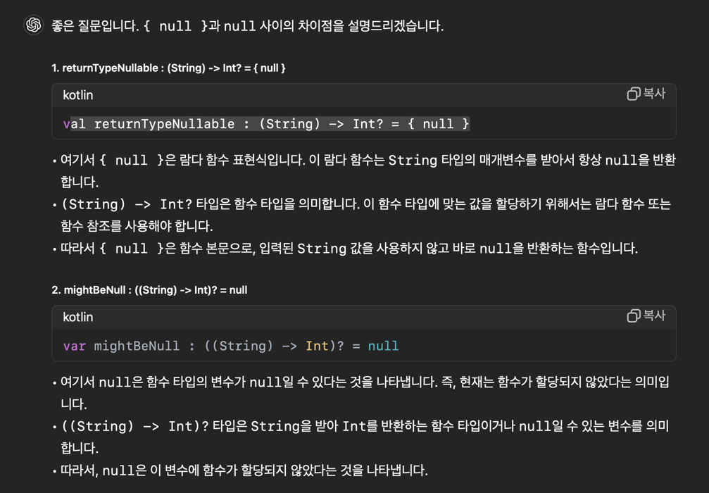
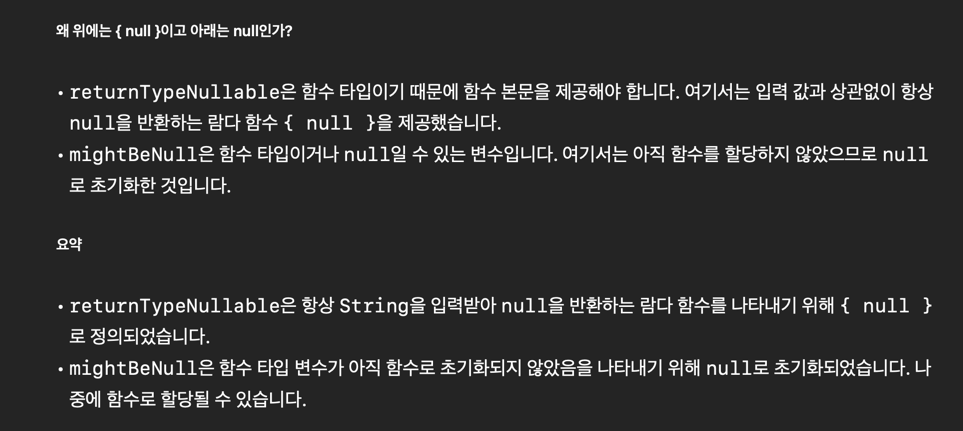
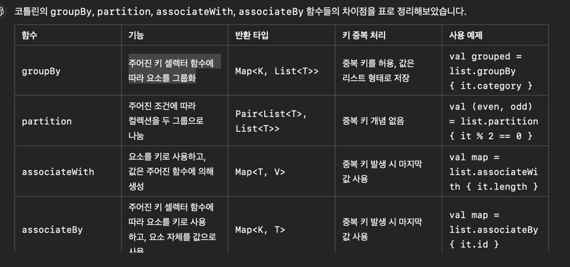
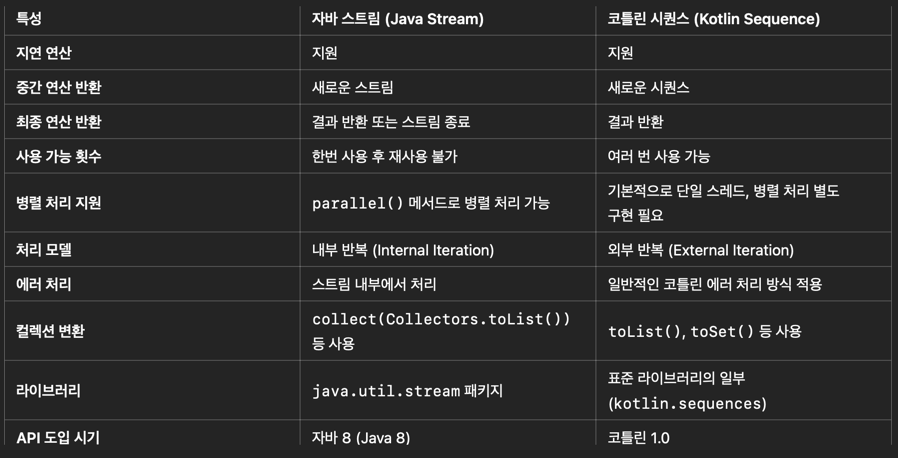

# 함수형 프로그래밍

## 람다

- 람다를 함수 리터럴이라고 부르기도 한다.
- 파라미터가 하나일 경우 코틀린은 자동으로 파라미터 이름을 it으로 만든다. 즉 파라미터가 하나일 경우 n -> 같은 코드를 쓸 필요가 없다.
- 함수의 파라미터가 람다뿐이면 람다 주변의 갈호를 없앨수 있다.
- 람다가 마지막 파라미터이면 람다를 인자 목록을 감싼 갈호 다음에 위치시킬 수 있다.
- 람다를 이름 붙은 인자로 호출하고 싶으면 인자목록을 감싸는 갈호안에 위치 시켜야 한다.
- 사용하지 않는 인자에 _ 을 쓰면 컴파일러 경고를 무시할 수 있다.

```kotlin
fun main() {
    val list = listOf('a','b','c').mapIndexed{idx, elem-> "[$idx, $elem]"}
    //[[0, a], [1, b], [2, c]]
    println(list)
    val list2 = listOf('a', 'b', 'c').mapIndexed{ idx, _ -> "[$idx]" } //[[0], [1], [2]]\
    println(list2)
    val list3 = listOf('a', 'b', 'c').indices.map{"[$it]"} //[[0], [1], [2]]
    println(list3)
    
    listOf('a','b','c').indices // 0..2(IntRange객체)

    run{
        -> println("A Lamda")   // 이렇게도 쓸수 있지만, 매개변수가 없으면 -> 를 쓰지 않는 것을 권장한다.
    }
    run{
        println("Without args") // 매개변수가 없는 경우
    }

}
```
- 표준라이브러리 run은 인자로 전달된 람다를 호출하기만 한다.

## 람다의 중요성

- 람다를 var, val에 담을수 있다. 이렇게 하면 여러 함수에 같은 람다를 넘기면서 로직을 재사용할 수 있다.
- 아래 isEven 처럼 변수에 람다를 넣을때는 n 을 추론할수 있는 문맥이 존재하지 않으므로, **람다 파라미터의 타입을 명시해주어야 한다.**
```kotlin
fun main() {
    val isEven = {n:Int -> n%2 == 0 } // 람다를 변수에 담을수 있다.
    println(isEven)
}
```

- 람다는 자신의 요소 밖에 있는 요소를 참조할 수 능력이 있다. 이를 클로져라고 한다.
```kotlin
fun main() {
    val divider = 5
    val list = listOf(1, 5, 7, 19).filter { it % divider == 0 } // 자바는 final, effective final만 가능. 코틀린은 값이 변경되어도 참조 가능
    println(list)
    var sum = 0
    listOf(1, 5, 7, 10).filter { it % 5 == 0 }.forEach { sum += it }
    println(sum)

    val sum2 = listOf(1, 5, 7, 10).filter { it % 5 == 0 }.sum()
    println(sum2)
}
```

## 컬렉션에 대한 연산

- 람다를 활용한 리스트 초기화
```kotlin
fun main() {
    val list1 = List(10){it}   //[0, 1, 2, 3, 4, 5, 6, 7, 8, 9]  // idx가 전달되는 람다
    val list2 = List(10){0}  //[0, 0, 0, 0, 0, 0, 0, 0, 0, 0]
    val list3 = List(10){'a'+it} //[a, b, c, d, e, f, g, h, i, j] // 
    val list7 = List(10){"a"+it} //["a0" ,"a1", "a2"]
    
    val list4 = List(10){list3[it%3]} //[a, b, c, a, b, c, a, b, c, a]

    //mutable
    val list5 = MutableList(5,{10* (it+1)})  //[10, 20, 30, 40, 50]
    val list6 = MutableList(5){10* (it+1)}  //[10, 20, 30, 40, 50]


    println(list5)
    println(list6)

}
```

- 람다가 마지막원소인 경우 람다를 인자목록 밖으로 빼도 된다는 점을 기억하라.

```kotlin
fun main() {
    val list = listOf(-3,-1,5,7,10)

    val list1 = list.filter{it >0} //[5, 7, 10]
    val list11 = list.filterNot{it >0} //[-3, -1]

    val cnt = list.count{it >0} //3

    val elem = list.find{it>0} //5
    val elem2 = list.firstOrNull{it == 11} // null
    val elem3 = list.lastOrNull{it>0} //10
    val bool1 = list.any{it > 0} // true
    val bool2 = list.all{it > 0} // false
    val bool3 = list.none{it == 11} // true

    val (pos, neg) = list.partition { it>0 } //([5, 7, 10], [-3, -1]) Pair 타입
//    pos // [5, 7, 10]
//    neg//[-3, -1]

    val exList = listOf(1,2,3,null)
    val resList= exList.filterNotNull() // [1, 2, 3]
    val resList2 = exList.filterIsInstance<Int>() //[1,2,3]
    val resList3 = exList.filterIndexed{idx,_-> idx>1} //[3, null]
    val resList4 = exList.filterIndexed{ idx, _ -> idx>3 } //[]
//    val mut = mutableListOf<Int>()
//    val resList5 = exList.filterIndexedTo(mut) { idx, _ -> idx > 1 }
    val resList6 = exList.asReversed() //[null, 3, 2, 1]
    val resList7 = exList.shuffled()// 랜덤
    val resList8 = exList.single()


    println(resList8)


}
```
```kotlin
data class Product(
    val description: String,
    val price: Double
)

fun main() {
    val products = listOf(
        Product("bread", 2.0),
        Product("wine", 5.0),
    )

    val sum1 = products.sumOf { it.price } //7.0
    val obj = products.sortedByDescending { it.price } 
    //[Product(description=wine, price=5.0), Product(description=bread, price=2.0)]

    val obj22 = products.sortedBy { it.price }
    //[Product(description=bread, price=2.0), Product(description=wine, price=5.0)]

    val obj2 = products.minByOrNull{it.price}
//    Product(description=bread, price=2.0)


    val take = products.take(2) //[Product(description=bread, price=2.0), Product(description=wine, price=5.0)]
    val takeLast = products.takeLast(1); //[Product(description=wine, price=5.0)] (뒤에서 한개)

    val drop = products.drop(1) // 원본 그대로있음 [Product(description=wine, price=5.0)]
    val charList = List(5){'a'+ it}
    val takeLastWhile = charList.takeLastWhile { it > 'b' } // [c, d, e]

    println(takeLastWhile)
}

```
## 멤버참조

```kotlin
data class Message(
    val sender : String,
    val text : String,
    val isRead : Boolean
)

fun main() {
    val messages = listOf(
        Message("Kitty","Hey!",true),
        Message("Kitty","whrer are you?",false),
        Message("Boss","Meeting today",false),
    )

    val unread = messages.filterNot(Message::isRead)
    println(unread)
//[Message(sender=Kitty, text=whrer are you?, isRead=false), Message(sender=Boss, text=Meeting today, isRead=false)]
    

    val sortedWith = messages.sortedWith(compareBy(Message::isRead, Message::sender))
    //[Message(sender=Boss, text=Meeting today, isRead=false), Message(sender=Kitty, text=whrer are you?, isRead=false), Message(sender=Kitty, text=Hey!, isRead=true)]

    println(sortedWith)
}
```
- Message::isRead 가 멤버(프로퍼티)참조이다.
- 정렬순서를 지정해야 할때 프로퍼티 참조가 유용하다.
- 함수 타입이 필요한 곳에 함수를 바로 넘길수는 없지만, 함수에 대한 참조는 넘길 수 있다.
- **Message를 유일한 파라미터로 받는 최상위 수준 함수가 있으면 이 함수를 참조로 전달할 수 있다.** 최상위 수준 함수에 대한 참조를 만들 때는 클래스 이름이 없으므로 ::function 처럼 쓴다.


```kotlin
data class Message(
    val sender : String,
    val text : String,
    val isRead : Boolean,
    val attachments: List<Attachment>
)

data class Attachment(
    val type :String,
    val name :String
)
fun Message.isImportant() : Boolean =
    text.contains("Salary increase") ||
        attachments.any{
            it.type == "image" &&
                    it.name.contains("cat")
        }

fun ignore(message : Message) =
    !message.isImportant() &&
    message.sender in setOf("Boss", "Mom")


fun main() {
    val text = "Let's discuss goals" + "for the next year";
    val msgs = listOf(
        Message("Boss", text, false, listOf()),
        Message("Boss", text, false, listOf(
            Attachment("image","cute cats")
        )),
    )

    val filter = msgs.filter(::ignore)
    val filterNot = msgs.filterNot(::ignore)

    println(filter)
    println(filterNot)
}
```

- 생성자참조 ::Student

```kotlin
data class Student(
    val id :Int,
    val name: String,
)

fun main() {
    val names = listOf("Bob", "Choi","Kim")
    val students = names.mapIndexed { idx, name -> Student(idx, name) }
//    println(students)
    val students1 = names.mapIndexed(::Student)
    println(students1)
}
```

- 확장함수 참조

```kotlin
fun Int.times47() = times(47)
fun Int.times2() = times(2)

class Frog
fun Frog.speak() = "Ribbit!"

fun goInt(n: Int, g: (Int) -> Int) = g(n)
fun goFrog(frog: Frog, g: (Frog) -> String) = g(frog)

fun main() {
    println(goInt(12, Int::times47))
    println(goFrog(Frog(),Frog::speak))
}

```

## 고차함수

- 함수를 다른 함수의 인자로 넘기거나 반환값으로 돌려줄 수 있으면 고차함수를 지원한다고 한다.
- 0개 이상의 파라미터 타입목록을 둘러싼 **갈호로 시작하며**
- 파라미터로 람다를 받을때는 {} , 함수참조를 받을때는 () 를 쓴다.

```kotlin
val isPlus : (Int) ->  Boolean = {it > 0} // 갈호 안하면 에러 발생

fun main() {
    val any = listOf(1, 2, -3).any(isPlus)
    println(any)
}
```

- repeat() 는 두번째 인자로 함수를 받는다. 두번째 인자로 받은 동작을 첫번째 인자로 받은 Int 값이 지정된 횟수만큼 반복된다.

```kotlin
fun main() {
    repeat(4) {idx ->println("$idx")}
}
```

- 반환타입이 null로 만드는 것과 함주 전체의 타입이 null이 될수 있는 타입으로 만드는 것의 차이점을 이해하자.

```kotlin
fun main() {
    val retunTypeNullable : (String) -> Int? = {null}
    var mightBeNull : ((String) -> Int)? = null

    println(retunTypeNullable("abc"))

    mightBeNull = {s -> s.length}
    if (mightBeNull != null)
        println(mightBeNull("abc"))
}
```




## 리스트 조작하기

```kotlin
fun main() {
    val left = List(4){'a' + it}
    val right = List(4){'q' + it}
    println(left.zip(right)) //[(a, q), (b, r), (c, s), (d, t)]

    println(left.zip(0..4))// [(a, 0), (b, 1), (c, 2), (d, 3)]

    println((10..100).zip(right))} // [(10, q), (11, r), (12, s), (13, t)]
```


```kotlin
data class Person(
    val name: String,
    val id: Int
) {
    constructor(pair: Pair<String, Int>) : this(pair.first, pair.second)
}

fun main() {
    val names = listOf("Bob", "Jill", "Jim")
    val ids = listOf(1731, 9274, 8378)

    // zip을 통해 Pair 리스트 생성
    val pairs = names.zip(ids)

    // map을 사용하여 생성자 참조
    val people = pairs.map(::Person)

    println(people)
    //[Person(name=Bob, id=1731), Person(name=Jill, id=9274), Person(name=Jim, id=8378)]

}

[//]: # ()
[//]: # (```kotlin)

[//]: # (fun main&#40;&#41; {)

[//]: # (    val list = List&#40;4&#41;{'a' + it})

[//]: # ()
[//]: # (    val zipWithNext = list.zipWithNext&#40;&#41; //[&#40;a, b&#41;, &#40;b, c&#41;, &#40;c, d&#41;])

[//]: # (    println&#40;zipWithNext&#41;)

[//]: # ()
[//]: # (    val zipWithNext1 = list.zipWithNext&#40;&#41; { a, b -> "$a$b" })

[//]: # (    println&#40;zipWithNext1&#41; //[ab, bc, cd])

[//]: # (})

[//]: # (```)

- a to b = Pair<a,b> = (a,b) ;; Pair의 다른표현들
```kotlin
fun main() {
    val list = listOf(
        listOf(1,2),
        listOf(4,5),
        listOf(7,8),
    )

    println(list.flatten()) //[1, 2, 4, 5, 7, 8]

    val intRange = 1..3

    val mapped = intRange.map { a ->
        intRange.map { b -> a to b }
    }
    //[[(1, 1), (1, 2), (1, 3)], [(2, 1), (2, 2), (2, 3)], [(3, 1), (3, 2), (3, 3)]]
    
}
```

- 이넘.values() -> Array<이넘타입>
- 컬렉션.random(랜덤객체) -> 리스트에서 랜덤 요소 리턴
- 이터러블.map -> List
```kotlin
enum class Suit {
    Spade, Club, Heart, Diamond
}

enum class Rank(val faceValue: Int) {
    Ace(1), Two(2), Three(3), Four(4), Five(5),
    Six(6), Seven(7), Eight(8), Nine(9), Ten(10), Jack(10),
    Queen(10), King(10)
}

class Card(val rank: Rank, val suit: Suit) {
    override fun toString(): String {
        return "$rank of ${suit}s"
    }
}

val deck: List<Card> =
    Suit.values().flatMap { suit ->
        Rank.values().map { rank ->
            Card(rank, suit)
        }
    }

fun main() {
    val rand = Random(26)
    repeat(7) {
        println(deck.random(rand))
    }

}
```

## 맵 만들기

- 구조분해 할당식 갈호를 적어주기 (p287예제에는 없음.)
- 이터러블.groupby(그룹기준: 함수참조() or 람다{}) -> Map
- 문자열.first() -> 문자열 첫글자 리턴
- 
```kotlin
data class Person(
    val name: String,
    val age: Int
)

val names = listOf("Alice","Arthricia","Bob","Bill","Birdperson","Charlie","Crocubot","Franz","Revolio")
val ages = listOf(21,15,25,25,42,21,42,21,33)

fun person() : List<Person> =
    names.zip(ages).map{(name,age) -> Person(name,age)}

val groupBy: Map<Int, List<Person>> = person().groupBy(Person::age)
//{21=[Person(name=Alice, age=21), Person(name=Charlie, age=21), Person(name=Franz, age=21)], 15=[Person(name=Arthricia, age=15)], 25=[Person(name=Bob, age=25), Person(name=Bill, age=25)], 42=[Person(name=Birdperson, age=42), Person(name=Crocubot, age=42)], 33=[Person(name=Revolio, age=33)]}
val groupBy1 = person().groupBy { it.age > 20 }
//    {true=[Person(name=Alice, age=21), Person(name=Bob, age=25), Person(name=Bill, age=25), Person(name=Birdperson, age=42), Person(name=Charlie, age=21), Person(name=Crocubot, age=42), Person(name=Franz, age=21), Person(name=Revolio, age=33)], false=[Person(name=Arthricia, age=15)]}
val (up, down) = person().partition { it.age > 20 }

val groupBy2 = person().groupBy { it.name.first() }
//{A=[Person(name=Alice, age=21), Person(name=Arthricia, age=15)], B=[Person(name=Bob, age=25), Person(name=Bill, age=25), Person(name=Birdperson, age=42)], C=[Person(name=Charlie, age=21), Person(name=Crocubot, age=42)], F=[Person(name=Franz, age=21)], R=[Person(name=Revolio, age=33)]}

val associateWith = person().associateWith { it.name }
//    {Person(name=Alice, age=21)=Alice, Person(name=Arthricia, age=15)=Arthricia, Person(name=Bob, age=25)=Bob, Person(name=Bill, age=25)=Bill, Person(name=Birdperson, age=42)=Birdperson, Person(name=Charlie, age=21)=Charlie, Person(name=Crocubot, age=42)=Crocubot, Person(name=Franz, age=21)=Franz, Person(name=Revolio, age=33)=Revolio}
val associateBy = person().associateBy { it.age }
//{21=Person(name=Franz, age=21), 15=Person(name=Arthricia, age=15), 25=Person(name=Bill, age=25), 42=Person(name=Crocubot, age=42), 33=Person(name=Revolio, age=33)}
// 중복된 값이 하나만 나왔음(맨나중에 생성되는 값만 포함됨)

println(associateBy)
```


- 뮤터블맵.getOrPut(키값){디폴트값 생성 람다}
- 맵.map(람다) -> List
- 맵.mapKeys(람다) -> 맵
- 맵.mapValues(람다) -> 맵
- 맵.maxByOrNull{람다} -> 맥스값 or null

```kotlin
fun main() {
    val map = mapOf(1 to "one", 2 to "two")

//    println(map.getOrElse(0){"Zero"}) //Zero
    val mutableMap = map.toMutableMap()
    println(mutableMap.getOrPut(0){"Zero"}) //Zero
    println(mutableMap) //{1=one, 2=two, 0=Zero}

}
```
```kotlin
fun main() {
    val map = mapOf(1 to "one",
        2 to "two", 3 to "three", 4 to "four")

    val filterKeys = map.filterKeys { it % 2 == 1 }
    val filterValues = map.filterValues { it.contains("o") }
    val filter = map.filter { entry -> entry.key % 2 == 1 && entry.value.contains('o') }
    
    println(filter)
}
```
```kotlin
fun main() {
    val even = mapOf(2 to "two", 4 to "four")
    val map = even.map { "${it.key} = ${it.value}" } //[2 = two, 4 = four]

    val mapKeys = even.mapKeys { (num, _) -> -num }  // {-2=two, -4=four}
    val newMap = even.mapKeys { (num, value) ->
        // 값(value)을 변경해도 원본 맵에 영향을 미치지 않음 (대문자로 안바낌)
        val newValue = value.uppercase()
        -num
    }

    println(newMap) // {-2=two, -4=four}
    println(even)   // {2=two, 4=four}


    val mapValues = mapKeys.mapValues { (_, str) -> "minus $str" } // {-2=minus two, -4=minus four}

    println(mapValues)

    val map1 = even.map { (key, value) -> -key to "minus $value" }  // [(-2, minus two), (-4, minus four)]
    val toMap = map1.toMap() // {-2=minus two, -4=minus four}

    println(map1)
    println(toMap)

    val any = even.any { (key, _) -> key < 0 }
    val all = even.all { (key, _) -> key > 0 }
    val value = even.maxByOrNull { it.key }?.value
//    println(all)
//    println(value)
```

## 시퀀스

- 코틀린 시퀀스를 다른 함수형 언어에서는 스트림이라고 부른다.
- 자바의 스트림과의 호환성 유지를 위해 시퀀스라 부른다.
- List에 대한 연산은 즉시 연산된다. 즉시 연산은 직관적이고 단순하지만 최적은 아니다. 즉시 계산은 수평적 평가라고도 한다.
- 지연계산은 결과가 필요할때만 계산을 수행한다. 시퀀스에 대해 지연 계산을 수행하는 경우를 수직적 평가라고 한다.
- List.asSequece() -> 시퀀스로 변경
- 인덱싱을 제외한 모든 List 연산을 시퀀스에서도 사용가능
- 시퀀스보다 리스트가 더 많은 연산을 수행한다.
```kotlin
fun main() {
    val map = listOf(1, 2, 3, 4).asSequence()
        .filter { it % 2 == 0 }
        .map { it * it }  // kotlin.sequences.TransformingSequence@1d81eb93


    println(map.toString().substringBefore("@")) // kotlin.sequences.TransformingSequence
    println(map.toList())

}
```


- 중간연산은 결과로 다른 시퀀스를 리턴한다.
- 최종연산은 시퀀스가 아닌 값을 리턴한다.
- 시퀀스는 중간 연산을 저장해두기 때문에 각 연산을 원하는 순서대로 호출할 수 있고, 그에 따른 지연 계산이 발생한다.

```kotlin
fun main() {
    val generateSequence = generateSequence(1) { it + 1 } //kotlin.sequences.GeneratorSequence@3e3abc88

    val toList = generateSequence.take(3).toList() //[1, 2, 3]
    val sum = generateSequence.take(10).sum()  //55
}
```
- generatedSequence 의 리턴값은 무한시퀀스를 생성한다.
- 뮤터블리스트.removeAt(idx) -> idx 요소 pop
- 객체.takeIf{람다} -> 람다가 참이면 객체를 리턴 거짓이면 null
- 시퀀스는 한번만 이터레이션 할 수 있다. 이터레이션을 또 시도하면 에러가 발생하며, 여러번 처리하고 싶으면 시퀀스를 Collection 타입 중 하나로 변환해야 한다.

```kotlin
fun main() {
    val items = mutableListOf("first", "second", "third", "XXX", "4th")

    val seq = generateSequence {
        items.removeAt(0).takeIf { it != "XXX" }
    }  // kotlin.sequences.ConstrainedOnceSequence@4f3f5b24

    println(seq.toList())
    println(seq.toList()) // 두번 사용 안된다.
//    Exception in thread "main" java.lang.IllegalStateException: This sequence can be consumed only once.
//    	at kotlin.sequences.ConstrainedOnceSequence.iterator(SequencesJVM.kt:23)
//    	at kotlin.sequences.SequencesKt___SequencesKt.toList(_Sequences.kt:812)
//    	at chapter4.HyunJunSon.Ch04Kt.main(ch04.kt:530)
//    	at chapter4.HyunJunSon.Ch04Kt.main(ch04.kt)

}
```

## 지역함수

- 다른함수 안에 정의된 이름 붙은 함수를 지역함수라고 한다.
- 스트링빌더.appendLine(스트링) :: 개행문자 자동추가
- 지역함수는 클로져다. 즉, 지역함수는 자신을 둘러싼 환경의 var, val 을 포획한다. 
- 지역확장함수는 지역함수 스코프 내에서만 사용할 수 있다.
- 함수참조를 사용해 지역 함수를 참조 할 수 있다.
- 익명함수를 사용하면 리턴식때문에 람다로 정의하기 어려운 문제를 피할 수 있다.

- main 함수 내 forEach 에서 return은 main()함수를 끝낸다는 뜻이다.
- 람다를 둘러싼 함수가 아니라, 람다에서만 반환해야 한다면 레이블이 붙은 리턴을 사용하라.

```kotlin
fun main() {
    val list = listOf(1,2,3,4,5)
    val value = 3
    var result = ""
    list.forEach tag@{
        result += "$it"
        if (it == value) return@tag
    }
    println(result) //12345
}
```
- 레이블은 람다를 호출한 함수 이름이다.
- 람다 앞에 레이블@ 를 넣으면 새 레이블을 만들수 있다.
- reaturn@tag는 main() 이 아니라 람다를 반환시킨다.

## 리스트접기

```kotlin
fun main(){
    val list = listOf('a','b','c','d')
    val fold = list.fold("*") { acc, elem -> "($acc)+$elem" } //((((*)+a)+b)+c)+d
    val foldRight = list.foldRight("*") { elem, acc -> "$elem+($acc)" } //a+(b+(c+(d+(*))))
    
    println(fold)
    println(foldRight)
}

```

```kotlin
fun main() {
    val chars = "A B C D E".split(" ")
    val fold = chars.fold("*") { acc, e -> "$acc $e" } //* A B C D E
    val foldRight = chars.foldRight("*") { elem, acc -> "$elem $acc" } //A B C D E *
    val reduce = chars.reduce { acc, e -> "$acc $e" } // A B C D E
    val reduceRight = chars.reduceRight { e, acc -> "$acc $e" } //E D C B A
    //	•	acc는 초기값으로 리스트의 마지막 요소인 'E'를 가집니다.
    
//    println(fold)
//    println(foldRight)
    println(reduce)
    println(reduceRight)

}
```
```kotlin
fun main() {
    val list = listOf(11,13,17,19)
    val fold = list.fold(7) { sum, n -> sum + n } //67
    val runningFold = list.runningFold(7) { sum, n -> sum + n } //[7, 18, 31, 48, 67]
    val reduce = list.reduce { acc, e -> acc + e } //60
    val runningReduce = list.runningReduce { sum, n -> sum + n } //[11, 24, 41, 60]
    val result = list.runningFoldIndexed(0) { index, acc, num ->
        println("Index: $index, Acc: $acc, Num: $num")
        acc + num
    }

    println("Result: $result")


    println(runningReduce)
}
```
## 재귀

- 스택오버플로우를 막기 위해 코틀린 포함 함수형 언어들은 꼬리재귀라는 기법을 사용한다.
- 꼬리재귀를 목표는 호출 스택의 크기를 줄이는 것이다.
- 꼬리재귀는 컴파일러가 수행하는 최적화이지만, 모든 재귀함수에 적용할 수 있는 것은 아니다.
- tailrec을 성공적으로 사용하려면 재귀가 마지막 연산이어야 한다.

```kotlin
private tailrec fun sum(n: Long, acc: Long) : Long =
    if (n == 0L) acc else sum(n-1, acc+n)

fun sum(n: Long) = sum(n,0)
fun main() {
    println(sum(2))
    println(sum(10000))
    println(sum(100000))
}
```

```kotlin
fun fibonacci(n: Int) : Long {
    tailrec fun fibonacci(
        n: Int,
        current:Long,
        next: Long
    ): Long {
        if (n == 0) return current
        return fibonacci(
            n-1, next, current+next
        )
    }
    return fibonacci(n,0L, 1L)
}

fun main() {
    val map = (0..8).map { fibonacci(it) }
    println(map)

}
```