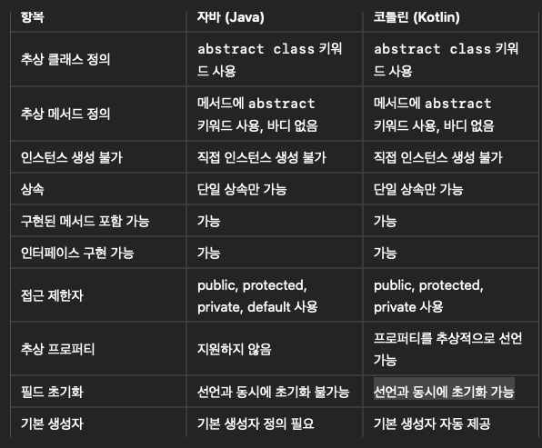
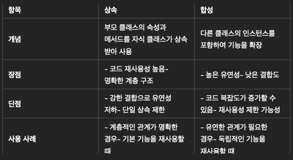
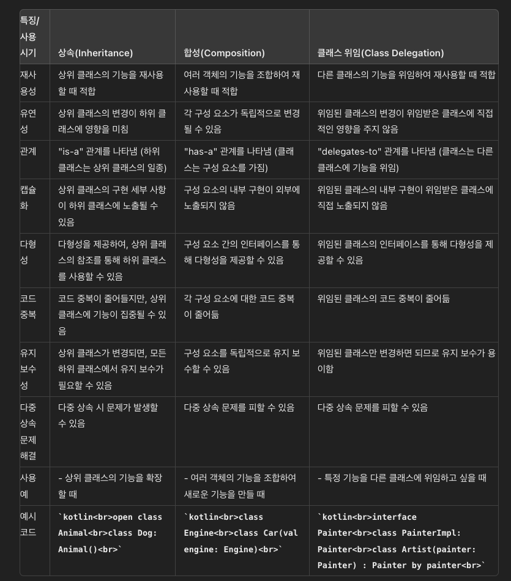

# 5부 객체지향 프로그래밍

## 55. 인터페이스
    - 인터페이스를 구현하는 클래스를 정의하려면, 클래스 이름 뒤에 콜론(:) 과 인터페이스 이름을 넣으면 된다.
    - 인터페이스를 구현 할때는 반드시 override 변경자를 붙여야 한다.( 안붙이면 컴파일 에러 발생!)

```kotlin
// 인터페이스 정의
interface Animal {
    fun makeSound()
    fun move()
}

// 인터페이스 구현 클래스
class Dog : Animal {
    override fun makeSound() {
        println("Woof")
    }

    override fun move() {
        println("Dog is running")
    }
}

class Cat : Animal {
    override fun makeSound() {
        println("Meow")
    }

    override fun move() {
        println("Cat is jumping")
    }
}

fun main() {
    val dog: Animal = Dog()
    val cat: Animal = Cat()

    dog.makeSound()
    dog.move()

    cat.makeSound()
    cat.move()
}
```

- 인터페이스가 프로퍼티를 선언할수도 있다. 이런 인터페이스를 구현하는 클래스는 항상 프로퍼티를 오버라이드 해야 한다.
- 인터페이스 내의 프로퍼티를 구현하는 방식은 3가지가 있다.
  1) 직접 리턴값을 넣어준다.
  2) getter 구현을 통해 리턴값을 넣어준다.
  3) 생성자 위치에 오버라이딩 함으로써 구현한다.

```kotlin
interface Player{
    val symbol: Char
}

class Food : Player{
    override val symbol = '.' 
}

class Robot : Player {
    override val symbol get() = 'R'  // 리턴타입은 적어도 되고 안적어도 됨 ,get()은 줄바꿔써도 됨,들여쓰기 의무아님
}

class Wall(override val symbol: Char) : Player

fun main(){
    listOf(Food(), Robot(), Wall('|')).map{ it.symbol}  // [., R, |]
}

```

- Enum도 인터페이스를 구현할수 있다.
- (**주의!**) 자바와 달리 코틀린은 enum class 라는 이름으로 선언한다.

### 자바 enum 인터페이스 구현 예시
```java
// 인터페이스 정의
interface Printable {
    void print();
}

// enum 타입에서 인터페이스 구현
enum DocumentType implements Printable {
    PDF {
        @Override
        public void print() {
            System.out.println("Printing PDF document");
        }
    },
    WORD {
        @Override
        public void print() {
            System.out.println("Printing Word document");
        }
    },
    EXCEL {
        @Override
        public void print() {
            System.out.println("Printing Excel document");
        }
    }
}

public class Main {
    public static void main(String[] args) {
        DocumentType pdf = DocumentType.PDF;
        pdf.print(); // Printing PDF document

        DocumentType word = DocumentType.WORD;
        word.print(); // Printing Word document

        DocumentType excel = DocumentType.EXCEL;
        excel.print(); // Printing Excel document
    }
}
```

### 코틀린 enum 인터페이스 구현 예시

```kotlin
// 인터페이스 정의
interface Printable {
    fun print()
}

// enum 타입에서 인터페이스 구현
enum class DocumentType : Printable {
    PDF {
        override fun print() {
            println("Printing PDF document")
        }
    },
    WORD {
        override fun print() {
            println("Printing Word document")
        }
    },
    EXCEL {
        override fun print() {
            println("Printing Excel document")
        }
    }
}

fun main() {
    val pdf: DocumentType = DocumentType.PDF
    pdf.print() // Printing PDF document

    val word: DocumentType = DocumentType.WORD
    word.print() // Printing Word document

    val excel: DocumentType = DocumentType.EXCEL
    excel.print() // Printing Excel document
}
```
- 단일추상메서드(SAM - Single Abstract Method)인터페이스 : fun interface로 구현
- 자바의 함수형 인터페이스와 같은개념

```java
@FunctionalInterface
interface MyFunctionalInterface {
  void myMethod();
}
```

```kotlin
fun interface ZeroArg{
  fun f() : Int
}

fun interface OneArg{
  fun g(n: Int) : Int
}

fun interface TwoArg{
  fun h(i:Int, j:Int) : Int
}

class VerboseZero : ZeroArg {
  override fun f() = 11
}

val verboseZero = VerboseZero()

val samZero = ZeroArg{ 11 }

class VerboseOne : OneArg {
  override fun g(n: Int) = n+ 47
}

val verboseOne = VerboseOne()

val samOne = OneArg{ it + 47}

class VerboseTwo : TwoArg{
  override fun h(i:Int, j:Int) = i+j
}

val verboseTwo = VerboseTwo()

val samTwo = TwoArg{ i,j -> i+j}

fun main() {
  println(verboseZero.f())//11
  println(samZero.f()) //11
  println(verboseOne.g(92))    //139
  println(samOne.g(92))    //139
  println(verboseTwo.h(11,47))  //58
  println(samTwo.h(11,47)) //58
}
```

## 56. 복잡한 생성자

- var, val을 파라미터 목록에 있는 파라미터에 붙이면, 그 파라미터를 프로퍼티로 만들면서 객체 외부에서 접근할수 있다.
- 생성자 코드를 쓰지 않았지만, 코틀린이 생성자 코드를 만들어 주었다.
- 생성자 파라미터에 var, val이 붙어 있지 않아도 init 블록에서 사용ㅎㄹ 수 있다.
- 생성자는 생성자 파라미터 목록과 init블록을 합친것이며, 객체 생성하는 동안 실행된다.


```kotlin
class Alien(val name:String)

fun main(){
    val alien = Alien("Pencilvester")
    println(alien.name) // 여기서 alien.name은 자동으로 생성된 get() 메서드를 통해 접근
}
```

```kotlin
class Alien(val name: String, val age: Int) {
    // 초기화 블록
    init {
        println("Alien $name has been created with age $age.")
    }
}

fun main() {
    val alien = Alien("Pencilvester", 300)
    println("Alien's name: ${alien.name}")
    println("Alien's age: ${alien.age}")
}
```

- 코틀린 에서는 init 절을 여럿 정의할 수 있으며, 각 init 블록은 클래스 본문에 정의된 순서대로 실행된다.

```kotlin
class MyClass {
    // 첫 번째 init 블록
    init {
        println("첫 번째 init 블록 실행")
    }

    // 변수 선언 및 초기화
    val number = 10

    // 두 번째 init 블록
    init {
        println("두 번째 init 블록 실행")
        println("number의 값은: $number")
    }

    // 메소드 정의
    fun display() {
        println("display 메소드 호출")
    }

    // 세 번째 init 블록
    init {
        println("세 번째 init 블록 실행")
    }
}

fun main() {
    val myObject = MyClass()
    myObject.display()
}
```

## 57. 부생성자

- 코틀린에서는 오버로드한 생성자를 부생성자라고 부른다.
- 부생성자를 만들려면 constructor 키워드 다음에 주생성자나 다른 부생성자의 파라미터 리스트와 구별되는 파라미터 목록을 넣어야 한다. 
- 부생성자 안에서는 this 키워드를 통해 주생성자나 다른 부생성자를 호출한다.
- **주생성자를 호출하지 않으면 컴파일이 되지 않는다.**
- 다른 생성자 호출(this 사용)하는 부분은 생성자 로직 앞에 위치해야 한다.
- 주생성자는 언제나 부생성자에 의해 직접 호출되거나, 다른 부생성자 호출을 통해 간접호출되어야 한다.

```kotlin
class WithSecondary(i: Int) {
    init{
        println("Primary: $i")
    }
    constructor(c: Char) : this(c - 'A'){
        println("Secondary: '$c'")
    }
    constructor(s: String) : this(s.first()){
        println("Secondary: \"$s\"")
    }
}


fun main() {
    fun sep() = println("-".repeat(10))
//    WithSecondary(1)  // Primary: 1
//    sep()
//    WithSecondary('D')  //Primary: 3
//                        // Secondary: 'D'
  sep()
  WithSecondary("Last Constructor") // Primary: 11
                                    // Secondary: 'L'
                                    //  Secondary: "Last Constructor"
}

```

```kotlin

enum class Material{
  Ceramic, Metal, Plastic
}
class GardenIem(val name: String){
    var material: Material = Material.Plastic
    constructor(
        name: String, material:Material
    ) : this(name){ //this(name){  // 주 생성자 호출
        this.material = material // // 현재 인스턴스의 material 속성 설정
    }

    constructor(
        material: Material
    ) : this("Strange Thing", material)

    override fun toString(): String = "$material $name"
}

fun main() {
    println(GardenIem("Elf")) // Plastic Elf
    println(GardenIem("Snowman").name) // Snowman
    println(GardenIem("Grazing Ball", Material.Metal)) //Metal Grazing Ball
    println(GardenIem(material = Material.Ceramic)) //Ceramic Strange Thing
    
}
```

## 58. 상속
- 상속 구문시 부모 클래스 이름에 ()를 붙이는 이유는 생성자를 호출하기 위해서이다.
- 코틀린의 클래스는 기본 final 값을 디폴트로 가지며, open 하지 않는 이상, 상속이 불가능하다.
  (자바는 final로 일부러 닫지 않는한 상속가능하다.)
- 코틀린에서는 명확한 의도가 있지 않는 한 상속과 오버라이드가 불가능하다.
- 자식클래스에서 부모클래스의 함수를 오버라이딩 했을때, 부모클래스의 함수를 접근하려면 super를 사용한다.

```kotlin
open class Parent

class Child : Parent()

//class GrandChild : Child() // error
```

```kotlin
open class GreatApe{
  protected var energy = 0
  open fun call() = "Hoo!"
  open fun eat() {
    energy += 10
  }
  fun climb(x: Int){
    energy -= x
  }
  fun energyLevel() = "Energy: $energy"
}

class Bonobo : GreatApe() {
  override fun call() = "Eep!"
  override fun eat(){
    energy += 10
    super.eat()
  }

  fun run() = "Bonobo run"
}

class Chimpanzee : GreatApe() {
  val additionalEnergy = 20
  override fun call() = "Yawp!"
  override fun eat() {
    energy += additionalEnergy
    super.eat()
  }
  fun jump() = "Chimp jump"
}
fun talk(ape: GreatApe): String{
  ape.eat()
  ape.climb(10)
  return "${ape.call()} ${ape.energyLevel()}"
}

fun main() {
  println(talk(GreatApe())) //Hoo! Energy: 0
  println(talk(Bonobo()))//Hoo! Energy: 0
  println(talk(Chimpanzee())) //Yawp! Energy: 20
}
```

## 59. 기반 클래스 초기화

- 기반클래스에 생성자 파라미터가 있다면, 파생 클래스가 생성되는 동안 반드시 기반 클래스의 생성자 인자를 제공해야 한다.
- 클래스를 상속할 때는 기반 클래스 생성자의 인자 목록을 기반 클래스 이름 뒤에 붙여야 한다.
- 기반 클래스 생성자 파라미터가 없어도 코틀린은 기반 클래스의 생성자를 인자없이 호출하기 위해 기반 클래스 이름 뒤에 괄호를 붙이도록 강제한다.
- 파생클래스의 파마티터가 꼭 기반 클래스 생성자의 파라미터수,타입, 순서에 의해 제약받을 필요는 없다.

## 60. 추상 클래스

- 코틀린은 프로퍼티를 추상적으로 선언 할 수 있다.
- 코틀린에서는 초기화 코드가 없으면 해당 참조를 abstract로 선언해야 하며, 그 참조가 속한 클래스에도 abstract 변경자를 붙여야 한다.(abstract 참조에는 반드시 타입을 지정해야 한다.)
- 추상메소드의 리턴타입을 적지 않으면 코틀린은 반환타입을 Unit이라고 간주한다.

```kotlin
abstract class WithProperty{
    abstract val x: Int
}
abstract class WithFunctions{
    abstract fun f(): Int
    abstract fun g(n: Double)
}
```

- 인터페이스에 함수나 프로퍼티 정의가 있을 때는 abstract가 불필요한 중복이므로 이를 생략할 수 있다.

```kotlin
interface Redundant{
    abstract val x: Int
    abstract fun f(): Int
    abstract fun g(n:Double)
}

interface Removed{
    val x: Int
    fun f(): Int
    fun g(n: Double)
}
```
- 추상클래스에는 상태가 있지만, 인터페이스에는 상태(프로퍼티 안에 저장된 데이터)가 없다.
- 인터페이스도 프로퍼티를 선언할수 있지만, 데이터는 실제로 해당 인터페이스를 구현하는 인터페이스 안에만 저장될 수 있다.

```kotlin
class IntList(val name: String){
    val list = mutableListOf<Int>()
}

fun main(){
    val ints = IntList("numbers")
    println(ints.name)
    ints.list += 7
    println(ints.list)
}
```

```kotlin
interface Parent{
    val ch: Char
    fun f(): Int
    fun g() = "ch = $ch; f() = ${f()}"
}
```

```kotlin
interface Parent{
    val ch: Char
    fun f(): Int
    fun g() = "ch = $ch; f() = ${f()}"
}

class Actual(
    override val ch: Char
) : Parent {
    override fun f() = 17
}

class Other : Parent {
    override val ch: Char
        get() = 'B'
    override fun f() = 34
}

fun main() {
    println(Actual('A').g()) //ch = A; f() = 17
    println(Other().g()) //ch = B; f() = 34

}
```

- 인터페이스가 함수 구현을 포함할 수 있으므로, 내부에 정의된 프로퍼티가 상태를 바꿀수 없는 경우에는, 인터페이스도 프로퍼티의 커스텀 게터를 포함할 수 있다.

```kotlin
interface PropertyAccessor{
    val a: Int
      get() = 11
}

class Impl : PropertyAccessor
```

```kotlin
interface User {
    val name: String
    val email: String
        get() = "$name@example.com"
}

class UserImpl(override val name: String) : User

fun main() {
    val user = UserImpl("JohnDoe")
    println(user.name)   // 출력: JohnDoe
    println(user.email)  // 출력: JohnDoe@example.com
}
```
- 코틀린은 자바처럼 다중 인터페이스를 상속할 수 있다. 이때 함수나 프로퍼티의 시그니처가 충돌하면 프로그래머가 직접 충돌을 해결해야 한다.

```kotlin
interface A {
    fun f() = 1
    fun g() = "A.g"
    val n: Double
        get() = 1.1
}

interface B {
  fun f() = 2
  fun g() = "B.g"
  val n: Double
    get() = 2.2
}

class C : A,B {
    override fun f() = 0
    override fun g() = super<A>.g()
    override val n: Double
      get() = super<A>.n + super<B>.n
}

fun main(){
    val c = C()
    println(c.f())
    println(c.g())
    println(c.n)
}

```

## 61. 업캐스트

- 코틀린의 확장함수를 사용하면 상속을 쓰지 않아도 기능을 확장할수 있다.
- 업캐스트를 사용하지 않는데 상속을 사용하지 마라. 이런 경우 상속이 필수적이지 않고, 코드를 불필요하게 복잡하게 만든다.
- 업캐스트 한 다음에는 기반 타입 멤버만 호출할 수 있다.

## 62. 다형성

- 다형적 호출에 대한 바인딩은 동적으로 일어난다. (코틀린은 런타임 시에만 다형성 관계에 있는 어떤 함수를 호출해야 할지 알수 있다)

## 63. 합성
- 상속보다 합성을 택하라.
- 상속과 합성 중 어느쪽이 더 잘 적용될지 불분명할 경우 합성을 먼저 시도해야 한다.

```kotlin
class Features {
    fun f1() = "feature1"
    fun f2() = "feature2"
}

class Form{
    private val features = Features()
    fun operation1() =  
        features.f2() + features.f1()
    fun operation2() =
        features.f1() + features.f2()
}
```

```kotlin
// 부모 클래스
open class Animal {
    open fun sound() {
        println("Some generic animal sound")
    }
}

// 자식 클래스
class Dog : Animal() {
    override fun sound() {
        println("Bark")
    }
}

fun main() {
    val dog = Dog()
    dog.sound()  // 출력: Bark
}
```

## 64. 상속과 확장
- 리스코프 치환 원칙, 즉 치환가능성으로 기반 클래스를 받아들이는 함수는 반드시 하위클래스 객체를 받아도 아무 문제가 없어야 한다.
- 상속을 하는 동안 함수를 추가하는 것은 허용하지만, 이는 코드 냄새이나 기술부채가 될 수 있다.
- 상속대신 확장함수를 사용하면 상속을 사용하지 않고 기반 클래스의 인스턴스를 직접 확장할 수 있다.

- 확장함수는 다형적으로 동작하지는 않는다.(멤버함수가 아니기 때문)
- 두타입에대해 대해 동작하도록 만들려면 오버라이딩을 이용해야한다.
- Sequence 인터페이스의 멤버함수는 하나이고, 나머지는 모두 확장함수이다.
- "필수적인 메서드만 포함하는 간단한 인터페이스를 만들고, 모든 부가 함수를 확장으로 정의하라." 는 코틀린 철학이 되었다.

- 상속에 열린 클래스라는 점에 의존하는 점을 피하려면, Adapter 패턴을 사용할 수 있다.
```kotlin
// 1. MyClass 클래스 정의
class MyClass {
    fun specificRequest(): String {
        return "MyClass specific request"
    }
}

// 2. userMyClass(mc: MyClass) 함수 정의
fun userMyClass(mc: MyClass) {
    println(mc.specificRequest())
}

// 3. LibType 인터페이스 정의 (어댑터 패턴에서 타겟 인터페이스 역할)
interface LibType {
    fun request(): String
}

// 4. MyClassAdapterForLib : LibType 클래스 정의 (어댑터 클래스)
class MyClassAdapterForLib(private val myClass: MyClass) : LibType {
    override fun request(): String {
        return myClass.specificRequest()
    }
}

// 어댑터 패턴을 사용하는 예시 코드
fun main() {
    // MyClass 객체 생성
    val myClass = MyClass()

    // 어댑터 사용
    val adapter: LibType = MyClassAdapterForLib(myClass)
    
    // 어댑터를 사용하여 LibType 인터페이스로 MyClass의 메서드 호출
    println(adapter.request())
    
    // 기존의 MyClass를 직접 사용하는 함수 호출
    userMyClass(myClass)
}
```

- 함수가 private 멤버에 접근해야 한다면 멤버함수를 정의할 수 밖에 없다.
- 확장함수의 가장 큰 한계는 오버라이드 할수 없다는 점이다.

```kotlin
class Z(var i: Int = 0){
  private var j = 0
  fun increment(){
      i++
      j++
  }
}

fun Z.decrement(){
    i--
//    j--    private은 접근 불가능
}
```

```kotlin
open class Base{
    open fun f() = "Base.f()"
}

class Derived : Base() {
    override fun f() = "Derived.f()"
}

fun Base.g() = "Base.g()"
fun Derived.g() = "Derived.g()"

fun useBase(b: Base){
    println("Received ${b::class.simpleName}")
    println(b.f()) // 멤버함수
    println(b.g()) // 확장함수
}

fun main() {
    println(useBase(Base()))
    println(useBase(Derived()))
}
```

- 멤버함수는 타입의 핵심을 반영(그 함수가 없이는 그 타입을 상상할수 없어야 한다.)
- 확장함수는 타입의 존재에 필수적이지 않은, 대상 타입을 지원하고 활용하기 위한 외부연산이나 편리를 위한 연산이다.
- 상속보다는 확장함수와 상속을 택하라.

## 65. 클래스 위임

- 클래스가 기존의 구현을 재사용하면서 동시에 인터페이스를 구현해야 하는 경우, 상속과 클래스 위임이라는 두가지 선택지가 있다.
- 클래스 위임은 상속과 합성의 중간 지점이다.

```kotlin
interface Controls{
    fun up(velocity: Int): String
    fun down(velocity: Int): String
    fun left(velocity: Int): String
    fun right(velocity: Int): String
    fun forward(velocity: Int): String
    fun back(velocity: Int): String
    fun turboBoost(): String
}

class SpaceShipControls : Controls {

    override fun up(velocity: Int) = "up $velocity";
    override fun down(velocity: Int) = "down $velocity";
    override fun left(velocity: Int) = "left $velocity";
    override fun right(velocity: Int) = "right $velocity";
    override fun forward(velocity: Int) = "forward $velocity";
    override fun back(velocity: Int) = "back $velocity";
    override fun turboBoost() = "turbo Boost";
}

class ExplicitSpaceShipControls : Controls {
    private val controls = SpaceShipControls()
    override fun up(velocity: Int) = "controls.up $velocity";
    override fun down(velocity: Int) = "controls.down $velocity";
    override fun left(velocity: Int) = "controls.left $velocity";
    override fun right(velocity: Int) = "controls.right $velocity";
    override fun forward(velocity: Int) = "controls.forward $velocity";
    override fun back(velocity: Int) = "controls.back $velocity";
    override fun turboBoost() = "controls.turbo Boost";
}
fun main() {
    val controls = ExplicitSpaceShipControls()
    println(controls.forward(10))
    println(controls.turboBoost())
}
```
- 코틀린은 클래스 위임과정을 자동화 해준다. 
- 위임에 사용할 객체를 지정하기만 하면 된다.
- 클래스를 위임하려면 by 키워드를 인터페이스 뒤에 넣고 by 뒤에 위임할 멤버 프로퍼티의 이름을 넣는다.

클래스 : 구현인터페이스 by 구현된 다른클래스

```kotlin
interface AI
class A : AI

class B(val a:A) : AI by a
```
```kotlin
interface Rectangle {
  fun paint(): String
}

class ButtonImage(
  private val width: Int,
  private val height: Int
) : Rectangle {
  override fun paint() = "painting ButtonImage($width, $height)"
}

interface MouseManager {
  fun clicked(): Boolean
  fun hovering(): Boolean
}

class UserInput : MouseManager {
  override fun clicked() = true
  override fun hovering() = true
}

class Button(
  private val width: Int,
  private val height: Int
) : Rectangle by ButtonImage(width, height), MouseManager by UserInput()

fun main() {
  val button = Button(10, 5)
  println(button.paint())
  println(button.clicked())
  println(button.hovering())
}
```
- Button은 두가지 타입 모두로 업캐스트 할수 있다. 클래스 위임은 다중 상속의 필요성을 해결해준다.
- 상속,합성,클래스위임 중 합성을 먼저 시도하라.


## 66. 다운캐스트

- 다운캐스트는 실행시점에 일어나며 실행시점 타입식별을 의미한다.
- 코틀린의 스마트 캐스트는 자동 다운캐스트이다.
```kotlin
  interface Base{
      fun f()
  }
  class Derived1 : Base {
      override fun f() {}
      fun g() {}
  }
  class Derived2 : Base{
      override fun f() {}
      fun h() {}
  }
  
fun main(){
    val b1:Base = Derived1()
    if (b1 is Derived1)
        b1.g()
}
```
- 스마트 캐스트는 is를 통해 when의 인자가 어떤 타입인지 검색하는 when식 내부에서 아주 유용하다.

```kotlin
interface Creature

class Human : Creature {
    fun greeting() = "I'm Human"
}
class Dog : Creature {
    fun bark() = "Yip"
}
class Alien : Creature {
    fun mobility() = "Three legs"
}

fun what(c: Creature): String =
    when(c){
        is Human -> c.greeting()
        is Dog -> c.bark()
        is Alien -> c.mobility()
        else -> "Something else"
    }

fun main() {
    val c1: Creature = Human()
    val c2: Creature = Dog()
    val c3: Creature = Alien()
    
    println(what(c1))  // Output: I'm Human
    println(what(c2))  // Output: Yip
    println(what(c3))  // Output: Three legs
}

```

- 자동 다운캐스트는 특히 대상이 상수여야만 제대로 작동한다.
- 코틀린은 is로 타입을 검사하는 시점과 타입캐스트로 사용하는 시점 사이에 값이 변화하지 않도록 강제한다.
- 복잡한 식도 재계산 될수 있으면 스마트 캐스트 되지 않는다.

```kotlin
interface Creature

class Human : Creature {
    fun greeting() = "I'am Human"
}
class Dog : Creature {
    fun bark() = "Yip"
}
class Alien : Creature {
    fun mobility() = "Three legs"
}

fun what(c: Creature): String =
    when(c){
        is Human -> c.greeting()
        is Dog -> c.bark()
        is Alien -> c.mobility()
        else -> "Something else"
    }

fun dobBarkUnsafe(c: Creature)= (c as Dog).bark()
fun dogBarkUnsafe2(c: Creature) : String {
    c as Dog
    c.bark()
    return c.bark() + c.bark()
}

fun main() {
    println(dobBarkUnsafe(Dog()))
    println(dogBarkUnsafe2(Dog()))
}
```
- as 키워드는 일반적 타입을 구체적 타입으로 강제 변환한다.
- as가 실패하면 classCastException을 던진다. (안전하지 않은 캐스트)
- as? 는 실패해도 에러를 던지지 않으면 null을 반환한다.

```kotlin
interface Creature

class Human : Creature {
  fun greeting() = "I'am Human"
}
class Dog : Creature {
  fun bark() = "Yip"
}
class Alien : Creature {
  fun mobility() = "Three legs"
}

fun what(c: Creature): String =
  when(c){
    is Human -> c.greeting()
    is Dog -> c.bark()
    is Alien -> c.mobility()
    else -> "Something else"
  }
  fun dogBarkSafe(c: Creature) =
    (c as? Dog)?.bark() ?: "Not a Dog"

  fun main(){
      dogBarkSafe(Dog())
      dogBarkSafe(Human())
  }
```

```kotlin
interface Creature

class Human : Creature {
    fun greeting() = "I'am Human"
}
class Dog : Creature {
    fun bark() = "Yip"
}
class Alien : Creature {
    fun mobility() = "Three legs"
}

val group: List<Creature> = listOf(
    Human(), Human(), Dog(), Alien(), Dog()
)

fun main() {
    val dog = group.find { it is Dog } as Dog?
    println(dog?.bark())
    val filterIsInstance = group.filterIsInstance<Human>()
    println(filterIsInstance)
}
```

- filter()는 Creature List가 반환되고(부모클래스 리스트)
- filterIsInstance() 는 Human List를 반환한다.(필터한 그 리스트 클래스)


## 67. 봉인된 클래스

```kotlin
open class Transport
data class Train(
    val line: String
) : Transport()

data class Bus(
    val number: String,
    val capacity: Int
) : Transport()

fun travel(transport : Transport) =
    when(transport) {
        is Train -> "Train ${transport.line}"
        is Bus -> "Bus ${transport.number}: "+ "size ${transport.capacity}"
        else -> "$transport is in limbo!"
    }

fun main() {
    val map = listOf(Train("S1"), Bus("11", 90)).map(::travel)
    println(map)
}
```

```kotlin
sealed class Transport
```
- sealed 클래스를 직접 상속한 하위 클래스는 반드시 기반 클래스와 같은 패키지, 모듈 안에 있어야 한다.
- sealed 클래스를 when식에서 사용할때는 else를 요구하지 않는다.
Transport가 sealed라서 코틀린이 다른 Transport의 하위 클래스가 존재할 수 없다는 사실을 확신할 수 있기 때문이다.
- sealed 계층을 도입하면 새 하위 클래스를 선언할때 컴파일 오류를 발생시킨다.
- sealed 클래스는 기본적으로 하위클래스가 모두 같은 파일안에 정의되어야 한다는 제약이 가해진 추상 클래스이다.

```kotlin
sealed class Top
class Middle1 : Top()
class Middle2 : Top()

open class Middle3 : Top()

class Bottom3 : Middle3()

fun main() {
    println(Top::class.sealedSubclasses.map{ it.simpleName}) 
//[Middle1, Middle2, Middle3]
}
```
- sealed 클래스가 아니면 빈 리스트가 리턴된다.
- Top의 직접적인 하위 클래스만 결과에 들어 있다는 점에 유의하라. 
- 인터페이스는 sealed로 선언할수 없다

## 68. 타입검사
  - 특별한 처리를 위해 별도의 소수 타입을 선택하는 것이 타입 검사의 전형적인 유스케이스다.
  - 코틀린은 when식을 통해 타입검사코딩이라는 방식을 보여준다.
  - 전통적 객체지향 언어에서 타입검사코딩은 안티패턴으로 간주되는데, 코틀린의 sealed 클래스를 사용하면 이런 문제를 크게 완화할 수 있다.
  - sealed를 활용해도 직접적 하위클래스가 아니면 검사가 되지 않기 때문에 when 내포문 같은 것을 통해 모든 타입을 검사하도록 해주어야 한다.

## 69. 내포된 클래스

- 내포된 클래스에서는 외부 클래스의 private 프로퍼티에 접근할 수 있다.
- 내포된 클래스는 private 일수도 있으며, 이 경우 외부에서 볼 수 없다.
- private 한 내포클래스의 리턴하는 함수가 클래스 안에 있을 경우, 결과를 public으로 업캐스트해서 반환해야 한다.( 비공개 타입이 공개 타입을 확장한 경우에만 가능하다.)
- 함수안에 내포된 클래스를 지역 클래스라고 한다.
- **지역 인터페이스는 허용되지 않는다.**
- 지역 open 클래스는 거의 정의하지 않아야 한다.
- 지역클래스를 객체 반환하려면, 그 객체를 함수 밖에서 정의한 인터페이스나, 클래스로 업캐스트 해야 한다.

```kotlin

interface Amphibian

fun createAmphibian(): Amphibian {
  class Frog : Amphibian
  return Frog()
}

fun main() {
  val amphibian = createAmphibian()
//  val value = amphibian as Frog 안됨
}
```

- 인터페이스 안에 클래스를 내포시킬수도 있다.

```kotlin
import java.lang.reflect.Type

interface Item {
  val type: Type
  data class Type(val type: String)
}
```
- 이넘도 클래스, 인터페이스 안에 내포될 수 있다.
- 이넘은 함수에 내포시킬수는 없다.
- 이넘이 다른 클래스(다른 이넘 클래스도 마찬가지)를 상속할수 없다.

```kotlin
interface Game{
    enum class State {Playing, Finished}
    enum class Mark {Blank, X, O}
}   
```


## 70. 객체
## 71. 내부 클래스
## 72. 동반 객체`
