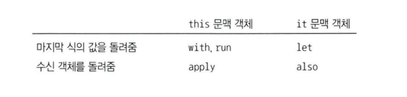

# 7부. 파워툴

## 79. 확장 람다
```kotlin
val va: (String, Int) -> String = { str, n ->
    str. repeat(n) + str. repeat(n)
}
val vb: String.(Int) -> String = {
    this.repeat(it) + repeat(it)
}
```
- 확장 대상객체(위의 String)이 수신 객체가 되고 this를 통해 접근할 수 있다.
- this를 생략한 형태로 호출 가능하다.(repeat(it))
- 파라미터가 하나뿐이면, it으로 그 유일한 파라미터를 가리킬 수 있다.
- 호출은 확장호출형태로 "Vanbo".vb(2) 처럼 호출도 되고 vb("Vanbo",2) 처럼 전통적 함수 형태로 호출도 가능하다.
- va는 확장형태로 호출이 안된다.
- 이런 확장함수를 코틀린문서에서는 수신 객체가 지정된 함수 리터럴이라고 부른다.

```kotlin
val zero: Int.() -> Boolean = { this == 0}
val one: Int.(Int) -> Boolean = { this % it ==0}
val two: Int.(Int, Int) -> Boolean = 
    { arg1, arg2 -> this % (arg1 + arg2) ==0}
val three: Int.(Int,Int,Int) -> Boolean = 
    { arg1, arg2, arg3 -> this % (arg1 + arg2 + arg3) == 0}
```

- one()에서는 it을 사용했는데 가리키는 대상이 헷갈릴수 있다. 이럴경우는 명시적으로 파라미터 이름을 지정하는 편이 낫다.

```kotlin
fun f1(lambda: (A,B) -> Int) = lambda(A(),B())
fun f2(lambda : A.(B) -> Int) = A().lambda(B())

fun unitReturn(lambda: A.() -> Unit) = A().lambda()

fun main(){
    unitReturn{
        "Unit ignores the return value"
    }
}
```

- 위와 같이 함수의 파라미터로 확장함수를 사용하는 경우가 더 일반적이다.
- 확장 람다의 반환타입이 Unit이면, 람다 본문이 만들어낸 결과는 무시된다.

```kotlin
fun String.transform1(n:Int, lambda: (String, Int) -> String) =
    lambda(this,n)
fun String.transform2(n:Int, lambda: String.(Int) -> String) =
    lambda(this,n)

val duplicate :String.(Int) -> String = {repeate(it)}
val alternate :String.(Int) -> String = 
    {
        toCharArray()
            .filterIndexed(i, _ -> i % it == 0)
            .joinToString("")
    }

fun main(){
    "hello".transform1(5, duplicate)
    "hello".transform2(5,duplicate).transform1(3,alternate)
}

```
- 확장람다 자리에 일반람다를 넣을수 있다. 단, 파라미터 목록이 서로 호환되어야 한다.

```kotlin
fun Int.d1(f: (Int) -> Int) = f(this) * 10
fun Int.d2( f: Int.() -> Int) = f() * 10
fun f1(n: Int) = n + 3
fun Int.f2() = this + 3
fun main() {
    74.d1(::f1) eq 770
    74.d2(::f1) eq 770
    74.d1(Int::f2) eq 770
}
```
- 확장함수에 대한 참조는 확장 람다와 타입이 같다.

```kotlin
open class Base {
open fun f() = 1
}
class Derived : Base() {
override fun f() = 99
}
fun Base.g() = f()
fun Base.h(x1: Base.() -> Int) = x1()
fun main () {
    val b: Base = Derived() // 745
    b.g() eq 99
    b.h { f() } eq 99
}
```
- 일반확장함수 Base.g()와 확장람다 Base.h() 모두에서 수식객체 f를 호출할때, 다형성이 동작한다.(Q)


```kotlin
fun exec(
    arg1: Int, arg2: Int,
    f: Int. (Int) -> Boolean
) = arg1. f(arg2)
fun main () {
    exec (10, 2, fun Int.(d: Int): Boolean {
    return this & d = 0
}) eq true
}
```
- 확장람다 대신 익명 함수 구문을 사용할수도 있다.
- 익명 확장 함수를 익명 람다 위치에 써도 받아 들여진다.

```kotlin
private fun clean() = buildString {
append ("ABCs: ")
(' a"..'x').forEach{ append (it) }
}
```
- buildString()은 확장람다를 인자로 받는다
- buildString()은 자체적으로 Stringbuilder를 생성하고 적용후, toString을 호출해준다.
- buildString()을 사용할때는 append() 호출의 수신 객체를 직접 만들고 관리할 필요가 없다.

```kotlin
val characters: List<String> = buildList {
add ("Chars:")
('a'.. 'd').forEach{ add("$it") }

val charmap: Map<Char, Int> = buildMap {
('A'.. 'F').forEachIndexed {n, ch -> put (ch, n) }
}
fun main ( ) {
    characters eq "[Chars:, a, b, c, d]"
    charmap eq "{A=0, B=1, (=2, D=3, E=4, F=5},"
}
```
- 확장 람다를 사용해 읽기전용 List, Map을 만들어내는 표준 라이브러리 함수가 있다.\
- 확장 람다 안에서 List, Map은 가변이지만, 결과는 읽기전용 List, Map이다.
- 확장 람다를 사용해 빌더를 구현하면 도메인특화언어(DSL)을 만들기 쉽다.

## 80. 영역 함수
- 영역함수는 가독성을 위해 존재한다.



```kotlin
data class Tag(var n: Int = 0) {
    var s: String = ""
    fun increment = ++n
}

fun main() {
    Tag(1).let {
    it.s = "let: ${it.n}"
    it. increment()
} eq 2
    Tag (2). let { tag ->
        tag.s = "let: ${tag.n}"
        tag.increment)
    } eq 3
    Tag (3). run {
        5 = "r'this
        increment) # 'this'
    } eq 4
    / with()
    with(Tag (4)) {
        5 = "with: $n"
        increment (
    } eq 5
    Tag (5) .apply 1
    5 = "apply: $n"
    increment)
} eq "Tag(n=6)"
Tag (6).also {
    it.s = "also: ${it.n}"
    it. increment( )
} eq "Tag(n=7)"
Tag(7). also { tag -> 
    tag. s = "also: ${tag.n}"
    tag. increment()
} eq "Tag(n=8)"

```
- this로 접근 가능한 영역함수 : run(), with(), apply()
- it로 접근 가능한 영역함수, 람다인자에 이름 붙을수 있다 : let(), also()
- 람다의 마지막 식값을 돌려주는 영역함수 : let(), run(), with()
- 변경한 객체를 돌려주는 영역함수 : apply(), with()

- let(), run(), apply(), also()에 대해 안전한 접근 연산자를 쓰면 수식 객체가 null인 경우 전체 영역이 무시된다.
- 영역함수는 연쇄 호출에서 null이 될수 있는 타입과 함께 쓸수 있다.
- 가독성을 높이는 목적으로 만들어진 것이므로 영역함수를 내포시키는 것은 의문의 여지가 있는 코딩이다.

### 영역함수는 인라인된다
- 영역함수를 inline으로 만들면 모든 실행 시점 부가 비용을 없앨수 있다. 이를 통해 영역함수를 주저하지 않고 원하는대로 쓸수 있다.
- 인라인함수에 람다를 전달하는 경우 클래스나 객체가 추가로 생기지 않는다.
- 원하는 함수에 언제나 inline을 적용할 수 있지만, 일반적으로 inline의 목적은 함수 인자로 전달되는 람다를 인라이닝하거나(영역함수) 실체화한 제네릭스를 정의하는 것이다.

## 81. 제네릭스 만들기
## 82. 연산자 로버로딩
## 83. 연산자 사용하기
## 84. 프로퍼티 위임
## 85. 프로퍼티 위임도구
## 86. 지연 계산 초기화 
## 87. 늦은 초기화