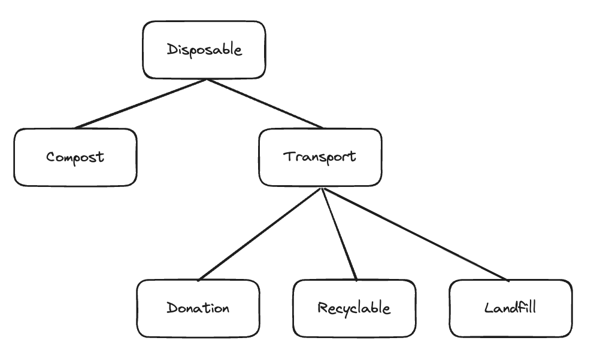
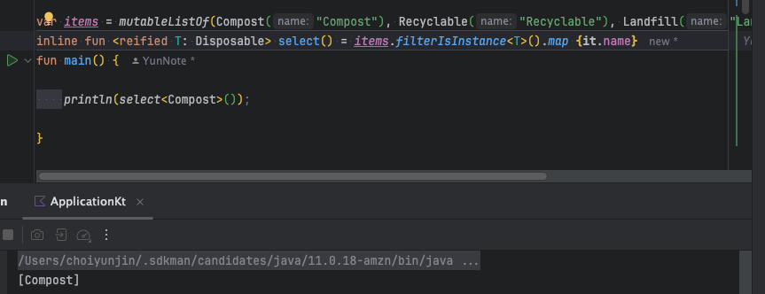

# Atomic 81 제네릭스 만들기

> 정해지지 않은 타입을 `제네릭 타입 파라미터(generic type parameter)` 라고 부른다


## Any

Any는 코틀린 클래스 계층의 루티이며, 모든 코틀린 클래스는 Any를 상위 클래스로 갖는다.

Any를 사용하는 방법은 2가지이다.

- Any를 타입으로 받아 해당 Any에 대해서만 사용하는 방법 (제한적) equals(), hashCode(), toString() 3가지 뿐.
- 확장함수를 통한 방식은 Any타입 객체에 대해 직접 연산은 할 수 없다. Any.xx()라고 선언하더라도 Any에 대해서만 적용될 뿐이고
Any 타입 객체의 내부 연산을 직접 호출할 수 없다.

Any를 사용한 방법은 지양하는 것이 좋다고 본다. 

타입을 구체적인 타입에 따른 수행을 하더라도 타입을 변환하다가 잘모된 타입을 지정하면 런타임 오류가 발생할 가능성이 있으며, 다운 캐스트를 해야하기 떄문.


```kotlin

class Person {
    fun speak() = "HI"
}

class Dog {
    fun bark() = "Ruff";
}

class Robot {
    fun communicate() = "삐빅"
}

fun talk(speaker : Any) = when (speaker) {
    
    is Person -> speaker.speak()
    is Dog -> speaker.bark()
    is Robot -> speaker.communicate()
    else -> "Not a Talker"
}
```

변경할 일이 없다면 지금 당장 해당 코드를 사용할만 하다, 하지만 지속적으로 추가되거나 변경될 가능성이 있다면
타입을 추가하거나 삭제할대마다 talk()함수를 변경해야하고 타입에 맞춰서 매번 수정을 해야한다. 

## 제네릭스 정의하기

> 제네릭스는 두 홑화살괄호 <> 안에 제네릭 플레이스홀더를 하나 이상 넣으면 제네릭 함수나 타입을 정의할 수 있다. 주로 제네릭 파라미터는
> T로 지정하긴 하나 원하는 단어로 작성하여도 괜찮다.

```kotlin
fun <T> genericFunction(arg: T) : T = arg

class genericClass<T> (val x : T) {
    fun f() : T = x
}
```

## 타입 정보 보존하기

> 제네릭스의 클래스나 제네릭 함수의 내부 코드는 T 타입에 대해 알 수 없다.
> 
> 이를 타입소거라고 한다. 제니릭스는 반환값의 타입 정보를 유지하는 방법이라고 생각할 수 있다. 이런방식을
> 사용하면 반환값이 원하는 타입인지 명시적으로 검사하고 변환할 필요가 없어진다.

```kotlin

class Car {}

// 해당 클래스는 Car 클래스에대해서만 활용 가능 
class CarCreate(private var c: Car) {
    fun get() = c
}

fun main() {

    val cc = CarCreate(Car())
    val car: Car = cc.get()
}

// TO-BE
class Car {}
class Bus {}

// 해당 클래스는 Car 클래스에대해서만 활용 가능
class Create<T>(private var c: T) {
    fun get(): T = c
}

fun main() {

    val cc = Create(Car())
    val car: Car = cc.get()
    println(car)

    val cb = Create(Bus())
    val bus: Bus = cb.get()
    println(bus)
}

```

---

## 타입 파라미터 제약

> 제네릭 타입 인자가 다른 클래스를 상속해야 한다고 지정한다 <T: Base> 이는 
> T가 Base 타입이거나 Base에서 파생된 타입이어야 허용한다는 의미이다.

```kotlin
interface Disposable {
    val name : String 
    fun action() : String
}

class Compost(override val name: String) : Disposable {
    
    override fun action(): String = "Add to Compost"
}

interface Transport: Disposable

class Donation(override val name: String) : Transport {

    override fun action(): String = "Donation"
}

class Recyclable(override val name: String) : Transport {

    override fun action(): String = "Recyclable"
}

class Landfill(override val name: String) : Transport {

    override fun action(): String = "Recyclable"
}
```




```kotlin

fun <T: Disposable> nameOf(disposable: Disposable) = disposable.name

// 확장함수 방식
fun <T: Disposable> T.name확장함수() = name

fun main () {
    val compost = Compost("ABC")
    println(nameOf<Compost>(compost))
    println(compost.action())

    println(compost.name확장함수())
}

```

그렇다면 여기서 우리는 하나 궁금해질 수 있다.

- 다형성도 해당 기능을 지원하는데 왜 다형성과 제네릭 두가지 방식을 제공하고 일반 다형성 대신 제약을 써야하는것일까??

이에 대한 답은 반환하는 타입에 있다. 

다형성을 쓰는 경우 반환타입을 기반으로 업캐스팅을 하여 반환해야 하지만 제네릭을 쓰면 정확하게 타입을 지정하여 반환받을 수 있다
따라서 성능적으로 오버헤드가 덜 발생하며, 타입이 고정되어 런타입 오버헤드가 없다.

```kotlin

fun 다형성함수( content: Disposable) = content
fun <T: Disposable> 제약함수 (content : T) = content

fun main() {
    val compost = Compost("Compost 테스트")

    val 다형성함수결과: Disposable = 다형성함수(compost);
    val 제약함수결과: Compost = 제약함수(compost)
}
```

추가로 타입 제약을 쓸 경우에만 제약이 이루어진 타입의 프로퍼티에 접근 가능하다.

---


### 타입 소거 

> 자바와의 호환성은 코틀린에서 필수인 부분이다. 최초의 자바에는 제네릭이 포함되어있지 않았고 이후 제네릭스가 추가되었다.
> 이미 많은 코드가 제네릭 없이 작성된 상태여서, 기존 코드를 꺠지않아야했기에 제네릭 타입은 컴파일 시점에만 사용 가능하고
> 런타임 바이트코드에서는 제네릭 타입 정보가 보존되지 않는다. 
> 
> 각각의 제네릭은 런타임시 Java는 Object로, Kotlin 은 Any? 로 변환된다고 한다. 이를 타입 소거라고 부른다.


### 함수의 타입 인자에 대한 실체화 

제네릭 함수를 호출할 때도 타입의 정보가 소거된다 따라서 함수 안에서는 제네릭 타입 파라미터를 사용해 할 수 있는 일이 별로 없다.

만약 그래도 함수 인자의 타입정보를 보존하려면 reified 키워드를 추가하면 된다.

```kotlin
import kotlin.reflect.KClass // 코틀른 클래스를 표현하는 클래스

fun <T:Any> a(kClass:KClass<T>) {}

fun <T:Any> b() = a(T::class)// 타입 소거 되어 컴파일 안됨 

// KClass 를 사용하여 해당 타입을 보존하여 타입정보를 전달 하여 해결 할 수 있다.
fun <T:Any> c(kClass: KClass<T>) = a(kClass)

```

이미 T의 타입을 알고있는데 굳이 명시적으로 타입을 전달하는것은 불필요한 중복이다 따라서 `reified` 키워드를 사용하면 이러한 문제가 해결된다

```kotlin
// refied 를 쓰기위해서는 제네릭 함수를 inline으로 설정해 줘야 한다.
inline fun <reified T: Any> d() = a(T::class)
```
위와 같이 설정한다면 클래스 ㅊ마조를 인자로 요구할 필요가 없다.

`refied` 키워드는 해당 키워드가 붙은 타입 인자의 타입 정보를 유지시키라고 컴파일러에 명령한다. 그러면 실행시점에도
타입 정보를 사용할 수 있기 때문에 함수 본문 안에서 이를 쓸 수 있다.


```kotlin


interface Disposable {
    val name : String
    fun action() : String
}

class Compost(override val name: String) : Disposable {

    override fun action(): String = "Add to Compost"
}

interface Transport: Disposable

class Donation(override val name: String) : Transport {

    override fun action(): String = "Donation"
}

class Recyclable(override val name: String) : Transport {

    override fun action(): String = "Recyclable"
}

class Landfill(override val name: String) : Transport {

    override fun action(): String = "Recyclable"
}

var items = mutableListOf(Compost("Compost"), Recyclable("Recyclable"), Landfill("Landfill"))
inline fun <reified T: Disposable> select() = items.filterIsInstance<T>().map {it.name}
fun main() {

    println(select<Compost>());
}
```



---

## 타입변성

- Box<T> : 무공변성 - 클래스간 아무런 하윝 타입 관계가 없다면 둘중 어느쪽도 반도래 대입될 수 있따.
- Box<out T> : 공변성 - 상위타입 허용, 상위타입에 대입 가능 
- Box<in T> : 반공변성  - 하위 타입 허용, 상위타입은 대입 불가능

```kotlin

class Box<T> (private var content: T) {}
class Box<in T> (private var content: T) {} // 반공변성 
class Box<out T> (private var content: T) {} // 공변성 
```

코틀린의 표준 라이브러리인 읽기전용 list는 공변성이며, MutableList는 add() 를 추가하기때문에 무공변이다.

함수는 일반적으로 공변적인 타입을 갖는다. (오버라이드 하는 함수가 오버라이드 대상 함수보다 더 구체적인 반환 타입을 돌려줘도 된다)


---

# Atomic 82 연산자 오버로딩 

