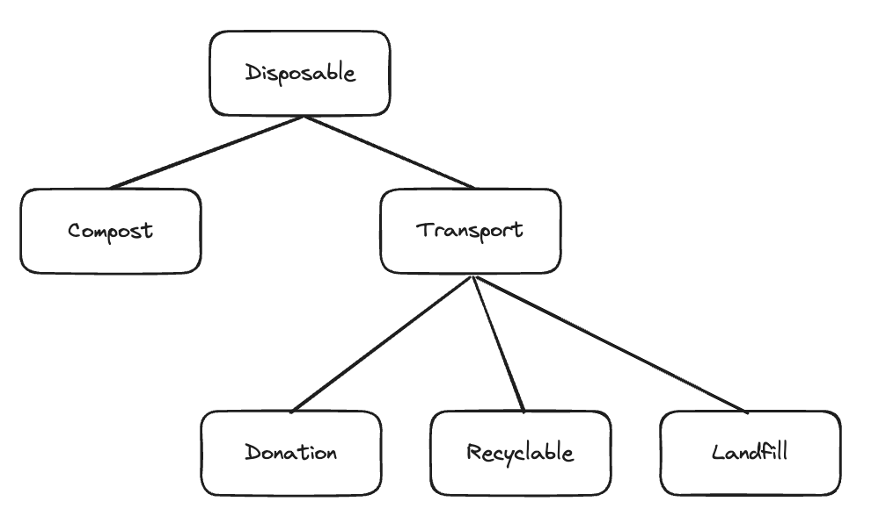
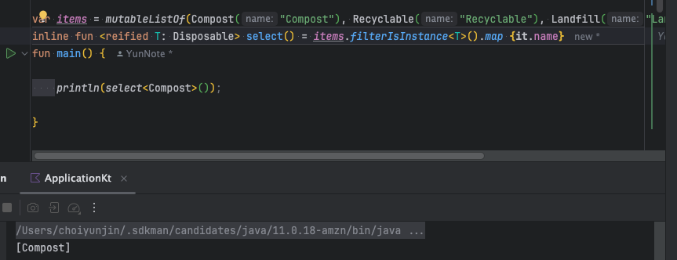
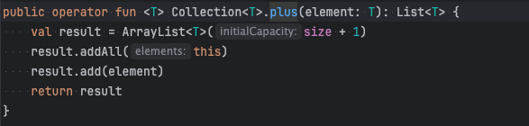
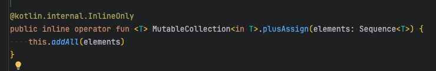

# Atomic 81 제네릭스 만들기

> 정해지지 않은 타입을 `제네릭 타입 파라미터(generic type parameter)` 라고 부른다


## Any

Any는 코틀린 클래스 계층의 루티이며, 모든 코틀린 클래스는 Any를 상위 클래스로 갖는다.

Any를 사용하는 방법은 2가지이다.

- Any를 타입으로 받아 해당 Any에 대해서만 사용하는 방법 (제한적) equals(), hashCode(), toString() 3가지 뿐.
- 확장함수를 통한 방식은 Any타입 객체에 대해 직접 연산은 할 수 없다. Any.xx()라고 선언하더라도 Any에 대해서만 적용될 뿐이고
Any 타입 객체의 내부 연산을 직접 호출할 수 없다.

Any를 사용한 방법은 지양하는 것이 좋다고 본다. 

타입을 구체적인 타입에 따른 수행을 하더라도 타입을 변환하다가 잘모된 타입을 지정하면 런타임 오류가 발생할 가능성이 있으며, 다운 캐스트를 해야하기 떄문.


```kotlin

class Person {
    fun speak() = "HI"
}

class Dog {
    fun bark() = "Ruff";
}

class Robot {
    fun communicate() = "삐빅"
}

fun talk(speaker : Any) = when (speaker) {
    
    is Person -> speaker.speak()
    is Dog -> speaker.bark()
    is Robot -> speaker.communicate()
    else -> "Not a Talker"
}
```

변경할 일이 없다면 지금 당장 해당 코드를 사용할만 하다, 하지만 지속적으로 추가되거나 변경될 가능성이 있다면
타입을 추가하거나 삭제할대마다 talk()함수를 변경해야하고 타입에 맞춰서 매번 수정을 해야한다. 

## 제네릭스 정의하기

> 제네릭스는 두 홑화살괄호 <> 안에 제네릭 플레이스홀더를 하나 이상 넣으면 제네릭 함수나 타입을 정의할 수 있다. 주로 제네릭 파라미터는
> T로 지정하긴 하나 원하는 단어로 작성하여도 괜찮다.

```kotlin
fun <T> genericFunction(arg: T) : T = arg

class genericClass<T> (val x : T) {
    fun f() : T = x
}
```

## 타입 정보 보존하기

> 제네릭스의 클래스나 제네릭 함수의 내부 코드는 T 타입에 대해 알 수 없다.
> 
> 이를 타입소거라고 한다. 제니릭스는 반환값의 타입 정보를 유지하는 방법이라고 생각할 수 있다. 이런방식을
> 사용하면 반환값이 원하는 타입인지 명시적으로 검사하고 변환할 필요가 없어진다.

```kotlin

class Car {}

// 해당 클래스는 Car 클래스에대해서만 활용 가능 
class CarCreate(private var c: Car) {
    fun get() = c
}

fun main() {

    val cc = CarCreate(Car())
    val car: Car = cc.get()
}

// TO-BE
class Car {}
class Bus {}

// 해당 클래스는 Car 클래스에대해서만 활용 가능
class Create<T>(private var c: T) {
    fun get(): T = c
}

fun main() {

    val cc = Create(Car())
    val car: Car = cc.get()
    println(car)

    val cb = Create(Bus())
    val bus: Bus = cb.get()
    println(bus)
}

```

---

## 타입 파라미터 제약

> 제네릭 타입 인자가 다른 클래스를 상속해야 한다고 지정한다 <T: Base> 이는 
> T가 Base 타입이거나 Base에서 파생된 타입이어야 허용한다는 의미이다.

```kotlin
interface Disposable {
    val name : String 
    fun action() : String
}

class Compost(override val name: String) : Disposable {
    
    override fun action(): String = "Add to Compost"
}

interface Transport: Disposable

class Donation(override val name: String) : Transport {

    override fun action(): String = "Donation"
}

class Recyclable(override val name: String) : Transport {

    override fun action(): String = "Recyclable"
}

class Landfill(override val name: String) : Transport {

    override fun action(): String = "Recyclable"
}
```




```kotlin

fun <T: Disposable> nameOf(disposable: Disposable) = disposable.name

// 확장함수 방식
fun <T: Disposable> T.name확장함수() = name

fun main () {
    val compost = Compost("ABC")
    println(nameOf<Compost>(compost))
    println(compost.action())

    println(compost.name확장함수())
}

```

그렇다면 여기서 우리는 하나 궁금해질 수 있다.

- 다형성도 해당 기능을 지원하는데 왜 다형성과 제네릭 두가지 방식을 제공하고 일반 다형성 대신 제약을 써야하는것일까??

이에 대한 답은 반환하는 타입에 있다. 

다형성을 쓰는 경우 반환타입을 기반으로 업캐스팅을 하여 반환해야 하지만 제네릭을 쓰면 정확하게 타입을 지정하여 반환받을 수 있다
따라서 성능적으로 오버헤드가 덜 발생하며, 타입이 고정되어 런타입 오버헤드가 없다.

```kotlin

fun 다형성함수( content: Disposable) = content
fun <T: Disposable> 제약함수 (content : T) = content

fun main() {
    val compost = Compost("Compost 테스트")

    val 다형성함수결과: Disposable = 다형성함수(compost);
    val 제약함수결과: Compost = 제약함수(compost)
}
```

추가로 타입 제약을 쓸 경우에만 제약이 이루어진 타입의 프로퍼티에 접근 가능하다.

---


### 타입 소거 

> 자바와의 호환성은 코틀린에서 필수인 부분이다. 최초의 자바에는 제네릭이 포함되어있지 않았고 이후 제네릭스가 추가되었다.
> 이미 많은 코드가 제네릭 없이 작성된 상태여서, 기존 코드를 꺠지않아야했기에 제네릭 타입은 컴파일 시점에만 사용 가능하고
> 런타임 바이트코드에서는 제네릭 타입 정보가 보존되지 않는다. 
> 
> 각각의 제네릭은 런타임시 Java는 Object로, Kotlin 은 Any? 로 변환된다고 한다. 이를 타입 소거라고 부른다.


### 함수의 타입 인자에 대한 실체화 

제네릭 함수를 호출할 때도 타입의 정보가 소거된다 따라서 함수 안에서는 제네릭 타입 파라미터를 사용해 할 수 있는 일이 별로 없다.

만약 그래도 함수 인자의 타입정보를 보존하려면 reified 키워드를 추가하면 된다.

```kotlin
import kotlin.reflect.KClass // 코틀른 클래스를 표현하는 클래스

fun <T:Any> a(kClass:KClass<T>) {}

fun <T:Any> b() = a(T::class)// 타입 소거 되어 컴파일 안됨 

// KClass 를 사용하여 해당 타입을 보존하여 타입정보를 전달 하여 해결 할 수 있다.
fun <T:Any> c(kClass: KClass<T>) = a(kClass)

```

이미 T의 타입을 알고있는데 굳이 명시적으로 타입을 전달하는것은 불필요한 중복이다 따라서 `reified` 키워드를 사용하면 이러한 문제가 해결된다

```kotlin
// refied 를 쓰기위해서는 제네릭 함수를 inline으로 설정해 줘야 한다.
inline fun <reified T: Any> d() = a(T::class)
```
위와 같이 설정한다면 클래스 ㅊ마조를 인자로 요구할 필요가 없다.

`refied` 키워드는 해당 키워드가 붙은 타입 인자의 타입 정보를 유지시키라고 컴파일러에 명령한다. 그러면 실행시점에도
타입 정보를 사용할 수 있기 때문에 함수 본문 안에서 이를 쓸 수 있다.


```kotlin


interface Disposable {
    val name : String
    fun action() : String
}

class Compost(override val name: String) : Disposable {

    override fun action(): String = "Add to Compost"
}

interface Transport: Disposable

class Donation(override val name: String) : Transport {

    override fun action(): String = "Donation"
}

class Recyclable(override val name: String) : Transport {

    override fun action(): String = "Recyclable"
}

class Landfill(override val name: String) : Transport {

    override fun action(): String = "Recyclable"
}

var items = mutableListOf(Compost("Compost"), Recyclable("Recyclable"), Landfill("Landfill"))
inline fun <reified T: Disposable> select() = items.filterIsInstance<T>().map {it.name}
fun main() {

    println(select<Compost>());
}
```



---

## 타입변성

- Box<T> : 무공변성 - 클래스간 아무런 하윝 타입 관계가 없다면 둘중 어느쪽도 반도래 대입될 수 있따.
- Box<out T> : 공변성 - 상위타입 허용, 상위타입에 대입 가능 
- Box<in T> : 반공변성  - 하위 타입 허용, 상위타입은 대입 불가능

```kotlin

class Box<T> (private var content: T) {}
class Box<in T> (private var content: T) {} // 반공변성 
class Box<out T> (private var content: T) {} // 공변성 
```

코틀린의 표준 라이브러리인 읽기전용 list는 공변성이며, MutableList는 add() 를 추가하기때문에 무공변이다.

함수는 일반적으로 공변적인 타입을 갖는다. (오버라이드 하는 함수가 오버라이드 대상 함수보다 더 구체적인 반환 타입을 돌려줘도 된다)


---

# Atomic 82 연산자 오버로딩 

> 연산자 오버로딩을 사용하면 새로 만든 타입에 대해 + 같은 연산자에 의미를 부여하거나 기존 타입에
> 대해 작용하는 연산자에 추가로 의미를 부여할 수 있다 .
> 

```kotlin
data class Num(val n: Int)

operator fun Num.plus(rval: Num) = Num(n + rval.n)

fun main() {
    println(Num(5) + Num(4))
}
```

plus 말고도 지정된 다양한 키워드를 통해서 사용 가능하며, 대부분의 연산자들은 이미 infix 키워드를 붙이지 않아도
이미 infix로 되어있어 굳이 사용하지 않아도 특정 operator 로 사용 가능하다.
( + 기호 외에도 plus()함수를 직접덕으로 호출 가능하다.)

---

## 동등성 

동등성(==) 과 비동등성(!=) 은 equals() 멤버 함수를 호출한다. data 키워드로 생성된 클래스의 경우
저장된 필드 기준으로 모두 비교하는 equals()를 오버라이드 해준다. 하지만 data클래스가
아닌 클래스에서는 따로 오버라이드 하지 않으면 내용이 아닌 참조를 비교하는 디폴트 비교가 수행된다.

Kotlin 에서의 equals() 함수는 확장 함수로 정의할 수 없는 유일한 연산자이다.
해당 함수는 반드시 멤버 함수로 오버라이드 되어야 한다.


```kotlin
class E(var v : Int) {
    
    override fun equals(other: Any?): Boolean = when {
        this === other -> true
        other !is E -> false
        else -> v == other.v
     }
    
    override fun hashCode(): Int = v
    override fun toString(): String = "E($v)"
}

fun main() {
    val a = E(1)
    val b = E(2)

    println(a == b) // false - a.equals(b)
    println(a != b) // true - !a.equals(b)
    
    //참조 동등성 
    println(E(3) === E(3)) // false
}
```

equals()를 오버라이드할떄는 항상 hashCode()도 오버라이드 해야 한다. 기본적인 규칙은 Java도 동일하지만
두 객체가 같다면 무조건 hashCode()도 동일한 값을 내놓아야 한다는 규칙이다. 해당 규칙이
지켜지지 않는다면 Map, Set같은 곳에서 제대로 동작하지 않는 경우가 밸생한다.

툴에서 제공하는 권장은 자동으로 생성해주는 기능을 활용하여 생성하길 권장한다.


## 산술 연산자

위에 나와있는 + 와 같이 이미 operator로 구현된 내용에 대해서 종류를 설명이라 패스. 도서 P519 에 다양하게 제공.

다만 보고 넘어갈것은 해당 연산자우선순위는 고정되어있고 내장 타입이나 커스텀 타입에서도 모두 동일하게 동작한다. 

---

### 연산자 관련된 내용은 비슷하여 패스

---

## 호출 연산자 

객체 참조뒤에 괄호를 넣으면 invoke()를 호출한다. 따라서 invoke() 연산자는 객체의 함수처럼 
동작하게 만든다. invoke()가 받을 수 있는 파라미터 개수는 우리가 마음대로 정할 수 있다 .

```kotlin
class Func {
    operator fun invoke() = "invoke()"
    operator fun invoke(i: Int) = "invoke(${i})"
}

fun main() {

    val func = Func()
    println(func())
    println(func(5))
    println(func.invoke())
    println(func.invoke(10))
}

```

## 역 작은따옴표로 감싼 함수 이름 

코틀린은 역작은따옴표(뺵틱) 을 사용하여 감싸는 경우 함수이름에 공백, 몇몇 비표준 글자, 예약어등을
사용하는것을 허용한다.

```kotlin
fun `A_B_C_D_E_F_G`() = "A_B_C_D_E_F_G"
fun `이 게 된 다 고 ?`() = "이 게 된 다 고 ?"

fun main() {
    
    // 됩니다..
    println(`이 게 된 다 고 ?`())
}
```

위와 같이 사용도 가능하지만 테스트에 대해 자세히 설명하는 읽기 쉬운 테스트 함수를 정의하기는 좋지만
실제 프로덕션 코드에는 사용하지 않는것을 권장한다.

복잡하게 infix 까지 섞어 쓰면 오히려 읽는사람은 이해하기 어려워 진다.

---

# Atomic 83 연산자 사용하기

> 실전에서 연산자를 오버로드 하는 경우는 드물며, 보통 직접 라이브러리를 만들떄만 사용한다.


kotlin 에서 `a += b` 는 plusAssign()을 호출한다. 하지만 읽기 전용 컬렉션에는 plusAssign()이 존재하지
않기 때문에 코틀린은 `a += b`를 `a = a + b` 로 변경하여 plus()를 호출하게 된다. 다만 이때 plus()는 기존에 있는 
컬렉션의 내용을 변경하는 것이 아닌 새로운 컬렉션을 생성한 후 리스트에 대한 var에 대입하게 된다.

```kotlin
//sample 

fun main () {
    var list = listOf(1,2)
    val init = list
    
    list += 3 // list = list + 3
    list.plus(4)
    
}
```





그러면 어떻게 해야 좋은 가이드일까 라고 생각해보면 var -> val 로 변경하면 된다. 읽기 전용으로 만든다면 
애초에 `+=` 사용시 컴파일되지 못하게 막아준다. 따라서 val을 주로 사용하고 필요시 var을 사용하는 것을 권장한다.

---

## 구조분해연산자

이미 앞서 나온내용으로 componentX()에 대한 내용입니다 .

구조분해할당을 사용하기 위해서는 직접 component operator을 구현하거나 data 클래스를 생성하면 된다 .

```kotlin

class Sample (val x : Int, val y : Int) {
    operator fun component1() : Int {
        return x
    }

    operator fun component2() : Int {
        return y
    }
}

// 또는 

// 컴파일러가 알아서 component 함수를 필드순서대로 생성해 준다. 
data class Sample2(val x: Int, val y: Int)

```

---


# Atomic 84 프로퍼티 위임 

> by 키워드를 사용하면 프로퍼티를 위임과 연결한다 . 
> 
> 프로퍼티가 val(읽기전용)인 경우 위임 객체의 클래스에는 getValue()가 정의되어야 하며 var일 경우 getValue()와 setValue()함수가 정의
> 되어있어야 한다.

```kotlin
class Readable(val i : Int) {

    val value: String by BasicRead()
}

class BasicRead {
    operator fun getValue(
        r: Readable,
        process: KProperty<*>
    ) = "getValue ${r.i}"

}

fun main() {

    val readable = Readable(15)
    println(readable.value)
}
```

해당 by키워드는 `프로퍼티 뒤에 by 를 지정하면 뒤에 나온 객체를 앞에있는 프로퍼티와 연결한다.`

getValue는 대략적으로 
```kotlin

class BasicRead {
    operator fun getValue(
        r: Readable,
        process: KProperty<*>
    ) = "getValue ${r.i}"

}
```

setValue는 총 3개의 파라미터를 전달 받는다.

setValue의 첫번째, 두번째 파라미터는 getValue와 동일하며 세번째 값은 프로퍼티 초기화 식에서 프로퍼티에 설정하려고 하는 값을 의미한다.
```kotlin

class BasicRead {
    operator fun setValue(
        r: Readable,
        process: KProperty<*>
        s: String
    ) = "getValue ${r.i}"

}
```

getValue()와 setValue()는 확장함수로도 선언이 가능하다

```kotlin
class Readable(val i : Int) {

    val value: Int by BasicRead()
}

class BasicRead

operator fun BasicRead.getValue(
    r: Readable,
    process: KProperty<*>
) = r.i

fun main() {

    val readable = Readable(15)
    println(readable.value)
}
```

---


# Atomic 85 프로퍼티 위임 도구

```kotlin
class Driver (map: MutableMap<String, Any?>) {

    var name: String by map
}


fun main() {

    val mutableMapOf: MutableMap<String, Any?> = mutableMapOf<String, Any?>()
    mutableMapOf.put("name", "HELLO")

    val driver = Driver(mutableMapOf)
    println(driver.name)

}
```
위와 같이 작성하면 프로퍼티 이름에 맞는 필드에 해당 값을 위임한다. 

어떻게 위임되는지는 샘플 코드로 설명하면 아래와 같다. 다만 실제로 이렇게 구현된것은 아니라 단순화한 내용이다

```kotlin
import kotlin.reflect.KProperty

operator fun MutableMap<String, Any>.getValue(
    thisRef: Any?, property: KProperty<*>
) = this[property.name]

operator fun MutableMap<String, Any>.setValue(
    thisRef: Any?, property: KProperty<*>, value: Any
) { this[property.name] = value }
```


# Atomic 86 지연 계산 초기화 
> 지금까지는 프로퍼티를 생성자 안에서 초기화하거나 정의하는 시점에 초기화 하였고, 접근할때 마다 값을 계산하는 커스텀 게터를 정의하였다.

세번쨰 방법으로는 지연계산 초기화이다.

- 복잡하고 시간이 오래걸리는 계산
- 네트워크 요청
- 데이터베이스 접근

위와 같이 해당 프로퍼티를 생성시점에 초기화하는 경우 두가지 문제를 야기한다

 - 애플리케이션 초기 시작 시간이 길어진다.
 - 사용하지 않거나 나중에 계산해도 되지만 프로퍼티 값을 계산하기 위해 불필요한 작업을 수행한다.

이러한 경우 해당 프로퍼티 뒤에 `by lazy` 키워드를 통해 초기화 코드를 뒤에 작성하면 사용 시점에 초기화가 실행된다.

개인적으로 지연계산 초기화라던지, 늦은 초기화는 사용하지 않는편이다... (의견 궁금)


# Atomic 87 늦은 초기화

`lateinit` 키워드를 사용하면 인스턴스가 생성된 다음에 프로퍼티를 초기화 할 수 있다.

제약 사항 
 - var 프로퍼티에만 적용 가능 , val에는 적용 불가
 - 프로퍼티의 타입은 널이 아닌 타입이어야 한다
 - 프로퍼티가 원시 타입의 값이 아니어야 한다
 - 추상 클래스의 추상 프로퍼티나 인스턴스의 프로퍼티에 lateinit을 적용할 수 없다.
 - 커스텀 게터 및 세터를 지원하는 프로퍼티에는 lateinit 적용할 수 없다/


```kotlin

class BB {
    lateinit var items: String

    fun setup() {
        items = "abcde"
    }

    fun check() = "tt" in items
}

fun main() {

    val bb = BB()
    bb.setup()
    println(bb.check())
}
```
늦은 초기화를 사용할때 기본적으로 초기화 함수를 호출하지 않고 진행된다면 오류가 나거나 경고메세지를 볼 수있다. 그래서 .isInitialized 사용을 통해
해당 필드가 초기화되었는지 판단해주는 함수를 제공하며 해당 함수는 lateinit으로 선언된 필드여야지만 확인 가능하다.